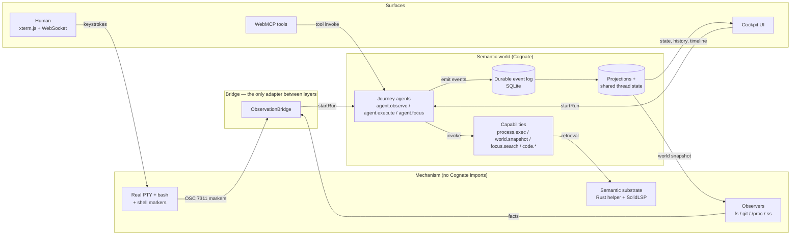

# gs-term documentation

gs-term is a browser-native **semantic terminal / control plane**. A human types into a real
pseudo-terminal; a machine calls capabilities; both doors land in the same durable record of what
happened, what changed, and what evidence supports that claim.

This documentation is a map of the software. Start anywhere below; each page names the files and
symbols that establish its claims.

## What this project is

gs-term runs one computational workspace (the *local* execution world, rooted at a configured
workspace directory) and models it semantically. Every command — typed by a person into bash, or
issued as `argv` by a tool — becomes a durable **execution** with the same event vocabulary, the
same derived **effects** carrying **evidence**, the same entry in execution history, and the same
reconciled **world state**.

The terminal is one compatibility surface over that model, not the model itself.

## What problem it solves

Terminals and automation tools normally split into two worlds. A person's shell knows nothing
about what a tool call did, and a tool call knows nothing about the shell. Neither can answer
"what changed", "on whose authority", or "with what proof". gs-term closes that gap: shell
command boundaries come from shell integration, world facts come from deterministic observers,
and both enter one event log through one adapter.

Three problems it is specifically built around:

1. **Convergence.** Human and machine doors must produce one semantic kind of execution, not two
   ontologies. See [execution.md](subsystems/semantic-execution.md).
2. **Truthful evidence.** Exit code 0 is not proof of a side effect; "could not check" is not
   "no change". See [effects-and-evidence.md](subsystems/effects-and-evidence.md).
3. **Explicit authority.** A human's unrestricted shell never implies machine authority.
   See [authority-and-policy.md](subsystems/authority-and-policy.md).

## The system in one picture

Notice what the diagram deliberately omits: no LLM, no database server, no container runtime, no
Node runtime, and no separate "agent API". Every surface reaches the same three agents.

## The concepts you need first

| Concept | One line |
| --- | --- |
| **Semantic world** | The workspace being modelled: files, repository, session processes, listening ports. |
| **Execution world** (`worldId`) | *Where* an operation runs — `local`, or a configured SSH world. An input, not a verb. |
| **Execution** | One command that ran, with timing, exit status, effects and evidence. |
| **Effect** | A claimed change (`file.created`, `port.opened`, …), always paired with evidence. |
| **Evidence** | What was observed, how, with what confidence, referencing which observations. |
| **World snapshot** | One coherent read of a world: files + git + processes + ports, with provenance. |
| **Observation** | A fact noticed about reality. No run, no intent. |
| **Action / run** | Intent: something was requested and executed. |
| **Capability** | A named, policy-checked operation (`process.exec`, `world.snapshot`, …). |
| **Journey** (`J1`–`J15`) | A catalogued end-to-end behaviour in the interaction domain model. |
| **SharedFocus** | The human-governed working context shared by human and agent. |
| **Mechanism** | An underlying implementation the semantic layer calls through a capability. |

Full definitions, including what each term does *not* mean here, are in
[concepts.md](concepts.md).

## A representative journey

A person types `touch notes.txt` into the terminal.

1. bash runs it and emits a command-done marker (an OSC 7311 escape sequence carrying the exit
   code and directory).
2. `ObservationBridge` receives the marker, reads the *pre* world snapshot it captured when the
   command started, and starts an `agent.observe` run with that snapshot attached.
3. The agent emits `execution.started`, reads the *post* snapshot, diffs the two, and emits
   `effect.observed` containing `file.created` with evidence naming both snapshots.
4. It emits `execution.completed` with `output: "unknown"` — the PTY stream was never parsed to
   reconstruct stdout, so stdout is honestly unknown.
5. When the run settles, the bridge re-derives the world view and writes it to shared thread state
   `session:main` with an expected version.
6. The cockpit, the timeline and a WebMCP tool reading the same projection see the same execution.

Full trace: [human-command-observation.md](workflows/human-command-observation.md).

## Where to go next

**I want to run it**
→ [getting-started.md](getting-started.md)

**I want to understand the architecture**
→ [mental-model.md](mental-model.md) then [architecture.md](architecture.md)

**I want to know what the words mean**
→ [concepts.md](concepts.md), then [journeys.md](reference/journeys.md)

**I want to change it**
→ [subsystems/](subsystems/) for the subsystem you are touching, then the matching
[how-to](how-to/) guide

**I want to add a feature**
→ [add-a-capability.md](how-to/add-a-capability.md),
[add-an-execution-world.md](how-to/add-an-execution-world.md),
[add-a-concept.md](how-to/add-a-concept.md),
[add-a-webmcp-tool.md](how-to/add-a-webmcp-tool.md)

**I am debugging something**
→ [troubleshooting.md](troubleshooting.md), then `bun run doctor`

**I need exact API or configuration details**
→ [reference/](reference/)

**I want to know *why* it is built this way**
→ [explanation/](explanation/)

**I want to find where something is implemented**
→ [source-map.md](source-map.md)

## Documentation map

- [documentation-map.md](documentation-map.md) — every page, its purpose, its Diátaxis
  classification, and the concepts it canonically owns.
- [source-map.md](source-map.md) — concepts, capabilities, workflows and subsystems mapped to
  their principal implementation locations.
- [architecture.md](architecture.md) — the canonical high-level architecture model.

## Repository-level documents (separate audiences)

- `AGENTS.md` — durable guidance for coding agents working in this repository.
- `.agents/CURRENT_STATUS.md`, `.agents/DEBT.md`, `.agents/plans/` — working state and the debt
  ledger. The debt ledger is the canonical home for known limitations with owners.
- `.sea/interaction/` — the interaction domain model, journey catalog and model→implementation
  handoff. This is the canonical *semantic* source; the documentation here explains the
  implementation that realises it.