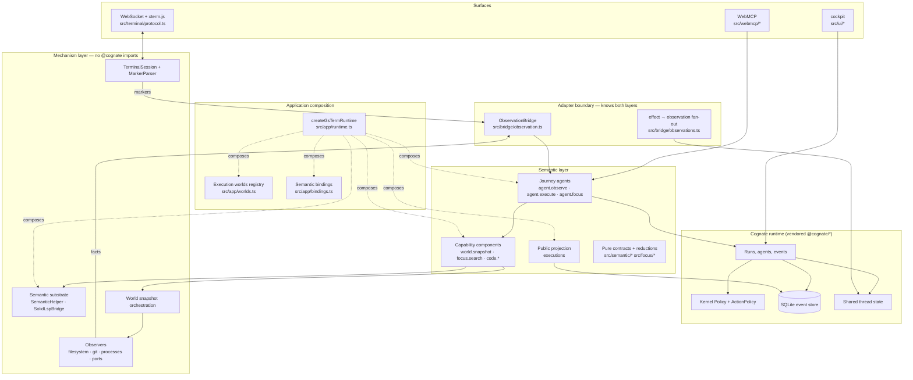
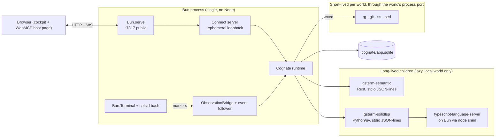
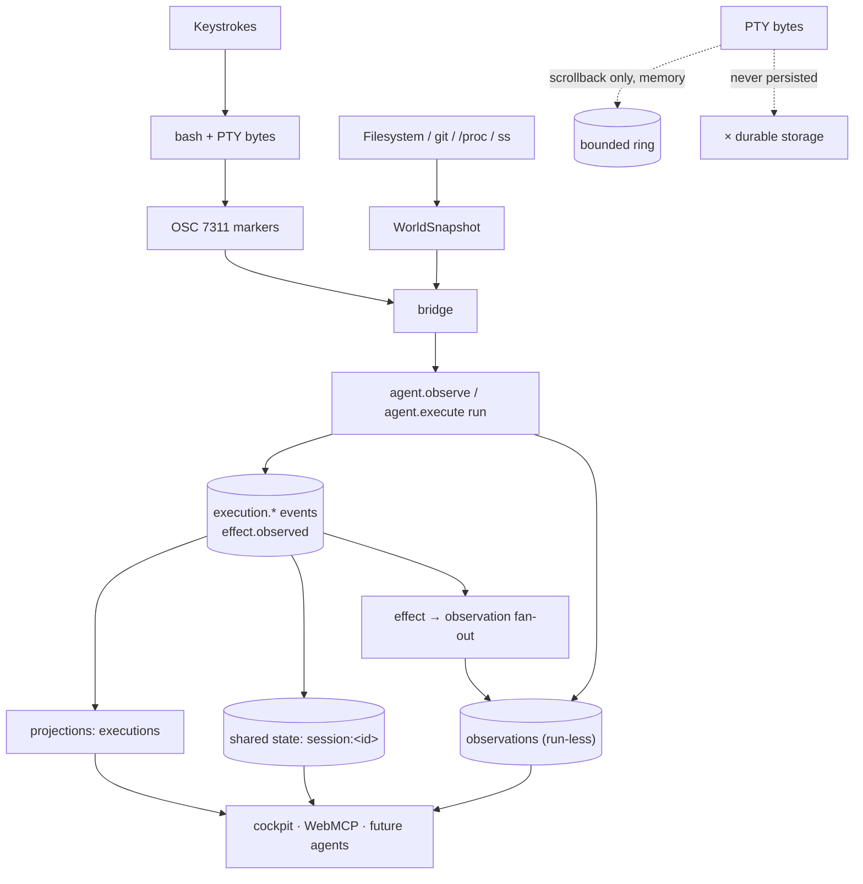
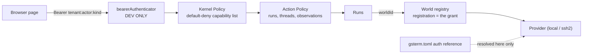

# Architecture

The canonical high-level architectural model. [mental-model.md](mental-model.md) is the conceptual
version of this page; this one adds modules, processes and boundaries.

## Logical architecture

### What to notice in this diagram

- **The bridge is the only edge that crosses the boundary.** `src/bridge/observation.ts` imports
  both Cognate runtime types and gs-term mechanism contracts. Nothing else does. If you add a
  second crossing point you have created a second ontology.
- **`src/app/*` is composition, not behaviour.** `runtime.ts` wires things together, `worlds.ts`
  holds provider mechanics, `policy.ts` holds grants, `bindings.ts` holds the explicit semantic
  binding. Each does one job.
- **The runtime is vendored, not rewritten.** `@cognate/*` packages are tarballs under
  `.cognate/vendor` installed by Bun. gs-term contributes configuration and bindings, never a
  parallel event bus or policy engine. `test/architecture.test.ts` fails if a local
  `class CapabilityRegistry`, `PolicyEngine`, `ToolRegistry`, `EventBus`,
  `SemanticEventLedger` or `AgentToolRegistry` appears.

## Runtime architecture

What actually exists while the server is up.

Facts worth stating explicitly:

- **One public HTTP server** on `server.hostname:server.port`, serving `/`, `/app.js`, `/app.css`,
  `/health`, `/api/meta`, `/ws`, and reverse-proxying `/cognate.v1.RuntimeService/*` to an internal
  Connect server bound to `127.0.0.1:0`.
- **One PTY.** `session.id` (default `main`) is a single durable session per server. The shell is
  respawned on every boot; the *thread* behind it is durable.
- **Two managed substrate processes**, started lazily and shared process-wide. They exist only for
  the local world. Remote worlds receive no substrate client and report those mechanisms honestly
  unavailable.
- **No Node anywhere in the product path.** The TypeScript language server does run, but it runs on
  Bun through an explicit `node → bun` shim inside the bridge's data directory. `bun run doctor`
  prints `Node: not required`, and `scripts/verify-all.sh --node-free` proves the product never
  resolves a real Node binary.

### Startup order

Startup order is not incidental; teardown reverses it.

1. **Model** — `loadGsTermModel` parses `domain/interaction-model.sea` and binds semantic objects to
   capability contracts. Required semantic ids are checked; a missing one is a startup failure.
2. **Runtime** — execution worlds registry, semantic substrate, then `createRuntime` with policy,
   actions, agents, components and the public projection.
3. **Session** — `Bun.Terminal` plus `setsid bash --init-file …`.
4. **Bridge** — marker listener attached, durable-run follower started.
5. **Transports** — internal Connect server, browser bundle build, then `Bun.serve`.

Then `session.start()` and `bridge.reconcile("boot")`.

Teardown: bridge → session → HTTP server → Connect server → runtime/worlds/substrate.

## Dependency architecture

Dependencies point in one direction only: surfaces → semantic → capability → mechanism.

| Component | Depends on | Must not depend on |
| --- | --- | --- |
| `src/ui/*` | `@cognate/client`, `@cognate/protocol-connect`, `src/webmcp/*` | mechanism internals |
| `src/webmcp/descriptors.ts` | an injected `ToolInvoker` | any transport |
| `src/agents/*` | `@cognate/runtime-api` capabilities, `src/semantic/*` | PTY, shell, `ssh` |
| `src/bridge/*` | Cognate runtime service + mechanism contracts | anything above it |
| `src/components/*` | `@cognate/kernel-api`, mechanism ports | Cognate runtime API specifics |
| `src/app/*` | everything below, composed | — |
| `src/terminal/*`, `src/shell/*`, `src/observers/*` | `src/semantic/contracts.ts` (types only) | `@cognate/*` entirely |
| `src/focus/*`, `src/mechanisms/*` | `src/semantic/*`, substrate clients | `@cognate/runtime-api` |

Two tests hold this in place: mechanism files containing `@cognate/`, and semantic directories
mentioning `ssh`.

## Data architecture

Where significant information originates, moves and persists.

Key properties:

- **World snapshots are the interchange format between mechanism and semantics.** One shape for
  every world, with a `world` provenance block naming the world id, kind and provider-safe metadata.
- **Effects are derived by diffing two snapshots of the same world**, not by interpreting stdout.
  That is why a remote execution can produce `file.created` with remote provenance while exit code
  alone proves nothing.
- **Evidence travels with every claim.** An effect carries `{what, how, confidence, refs}`; the refs
  name the snapshots or observation timestamps that support it.
- **Derived read models are rebuildable.** The `executions` projection has a version; bumping it
  forces a rebuild from the log rather than trusting a stale checkpoint.

## Control flow

Who orchestrates whom:

- **The Cockpit and WebMCP do not orchestrate the server.** They start runs and read state through
  the same client.
- **`agent.execute` / `agent.observe` orchestrate their own run**: snapshot → execute → snapshot →
  derive → emit. They call capabilities; they never touch the PTY.
- **`ObservationBridge` orchestrates reconciliation.** It follows durable run settlements for the
  session correlation prefix and serialises every write through a promise chain.
- **Cognate orchestrates durability.** Events, runs, projections, shared state and policy decisions
  are its responsibility, configured by gs-term.

## Trust and security boundaries

- The bearer authenticator is a development boundary, honestly labelled as such (debt D-026).
- The human PTY grants no machine authority: being able to type arbitrary shell commands never
  implies the ability to invoke `process.exec` as an agent.
- Capability grants are a fixed allow-list. Adding a capability means editing
  `src/app/policy.ts` — there is no dynamic grant mechanism.
- Per-world policy does not exist (debt D-002): world registration is the boundary.
- Secrets never cross the provider boundary. `sshAuthOf` turns a reference into a credential; the
  rest of the system sees only the auth kind.

## Extension points

| To add | You edit | You do not edit |
| --- | --- | --- |
| An execution world | `gsterm.toml` `[worlds.<id>]` (SSH in v0) | the semantic layer |
| A capability | `src/components/*`, `src/app/bindings.ts`, `src/app/policy.ts` | anything mechanism-side |
| A surface for an existing capability | `src/webmcp/descriptors.ts` | the capability itself |
| A journey | `src/agents/*`, registered in `src/app/runtime.ts` and `JOURNEY_AGENTS` | the projection |
| An observed fact kind | `src/observers/snapshot.ts` + `src/semantic/effects.ts` | — |
| A curated concept | `src/semantic/concepts.ts` | — |

Deliberately **not** built, seams preserved: WebMCP capability consumption, checkpoints and world
branching, additional shell adapters, multiple concurrent sessions, approval continuations. See
`.agents/DEBT.md`.

## Source trail

- `src/server/index.ts` — `startServer`, startup order, `/health`, `/api/meta`, WebSocket handlers
- `src/app/runtime.ts` — `createGsTermRuntime`, component and agent composition
- `src/app/worlds.ts` — `createExecutionWorlds`, `sshAuthOf`, `hostKeyPolicyOf`
- `src/app/policy.ts` — `gstermPolicy`, `gstermActions`
- `src/app/bindings.ts` — `loadGsTermModel`, `SEMANTIC_ID_*`, the single `bindCapabilities` call
- `src/bridge/observation.ts` — `ObservationBridge`, the only cross-layer adapter
- `src/projections/executions.ts` — `executionsProjection`, `isMarkerKey`, tenant-partitioned keys
- `src/terminal/session.ts` — `TerminalSession` (PTY, `setsid`, attach/detach)
- `src/mechanisms/substrate.ts` — `createSemanticSubstrate`, world gating
- `src/doctor.ts` — `doctor`, the `require-semantic` profile
- `test/architecture.test.ts` — boundary invariants
- `test/journeys/` — journey contracts named after the catalog ids