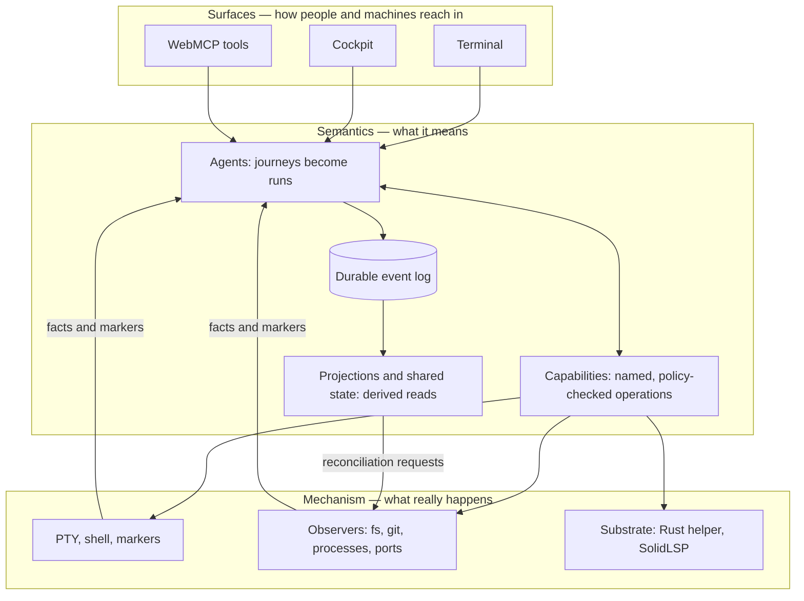

# Mental model

This page explains the system's conceptual structure. It avoids file paths until the end; the
[architecture page](architecture.md) takes the same content down to modules and processes.

## The one-sentence model

> A workspace is observed; actions on it produce executions; executions produce effects with
> evidence; facts and executions are recorded in one durable log; the log reduces to world state
> and history that every surface reads.

Everything below elaborates one link in that sentence.

## Three layers, one direction

gs-term separates **mechanism** (what actually happens on a machine) from **semantics** (what that
means) and puts a single adapter between them.

The rule that keeps this honest: **mechanism code never imports Cognate, and semantic code never
knows which provider or shell is behind it.** A test enforces the first half
(`test/architecture.test.ts`); a second test enforces the second by failing if the word "ssh"
appears anywhere in `src/agents`, `src/projections`, `src/webmcp` or `src/semantic`.

## Intent versus reality

The system distinguishes two kinds of entry into the log, and the distinction is load-bearing.

| | **Action / run** | **Observation** |
| --- | --- | --- |
| Means | Something was requested and executed. | A fact was noticed about reality. |
| Has a run | Yes | No |
| Has intent | Yes | No |
| Produced by | A human keypress resolved into a command, or an `argv` request | An observer noticing a port appeared, or an execution's derived effect |
| Attribution | Causal by construction | `correlated`, `caused`, or `unattributed` — never invented |

This split exists because pretending a discovered fact was an action fabricates intent and history.
A port that opened on its own is an observation with unknown causation, not an execution that
somebody asked for.

## Two doors, one kind

The same `execution.started → effect.observed → execution.completed` sequence is produced whether a
person typed the command or a tool supplied `argv`. Only metadata differs:

- `source`: `pty` | `ui` | `webmcp`
- `surface`: `terminal`, `cockpit`, `webmcp`, …
- `output`: real captured stdout/stderr for structured runs; the literal value `"unknown"` for
  PTY-observed runs, because the byte stream was never parsed into output
- `settled`: `derived` for structured runs (we diffed snapshots), `observed` for PTY runs (shell
  integration told us the boundary)

If a design change ever made these two produce different *kinds* of thing, the invariant is broken.

## Where things are

### Durable truth

One SQLite event log. Everything a reader sees is either an event or a reduction of events:

- **World state** — shared thread state on `session:<sessionId>`, versioned, rewritten by the
  bridge at settlement.
- **Execution history** — a projection folded from `execution.*` and `run.*` events.
- **Focus context** — shared thread state on the focus thread, human-only writes.

Rebuilding world state from the log plus observations yields the same state, which is the property
that makes restarts safe.

### Volatile truth

- PTY scrollback: a bounded in-memory ring, replayed to reconnecting viewers. Raw terminal bytes are
  never written to disk or into the log.
- Mechanism clients (Rust helper, SolidLSP bridge): started lazily, shared process-wide, disposed
  on shutdown.
- The structural map and mechanism availability: computed per request unless a caller supplies them.

## Time and causality

Causality is asserted only where it is established:

- A structured execution causes its own effects — causation is cited.
- A fact found during reconciliation is correlated to the session but its *cause* is `null`.
- An observation about an execution's effect is correlated, and `caused` only when a cause event id
  was supplied.
- A run that cannot reach `execution.completed` emits `execution.failed` and the run fails. It never
  half-settles.

## Reduction, not accumulation

Search and focus do not retrieve "more". They reduce: pick the cheapest mechanism that can answer
the question, narrow the candidate space, verify survivors, and return at most five results plus a
**receipt** recording which stages actually ran and how many candidates each eliminated. A stage
that did not run is never claimed in the receipt.

## Attention is not focus

Two separate things:

- **Attention** is a transient best estimate of where the human is looking. It is captured into a
  frozen `AttentionSnapshot` when a contextual search opens, so the referent of "this" cannot
  silently change when the pointer moves.
- **SharedFocus** is the durable working context. Only a human may change it. An agent's only
  channel is a `FocusCandidate` proposal; accepting, pinning or rejecting is a human act enforced by
  a server-side action policy, not by hiding buttons.

## Trust boundaries

1. **Transport** — a development bearer token of the form `Bearer <tenant>:<actorId>[:<kind>]`. This
   is explicitly not production authentication.
2. **Capability policy** — default deny. Only a small allow-list of capabilities, for recognised
   actors, may be invoked at all.
3. **Action policy** — which runs may start, which threads may be read or updated, who may record
   observations.
4. **World registration** — being registered as an execution world *is* the execution grant.
   Unregistered worlds fail closed rather than defaulting somewhere.
5. **Secrets** — SSH credentials are references in configuration (`agent`, `key:<path>`,
   `password-env:<VAR>`) resolved at the provider boundary. Everything above that boundary can see
   the authentication *kind* and a host-key fingerprint, never the secret.

## Where to go deeper

- [architecture.md](architecture.md) — the same model with modules, processes and diagrams.
- [concepts.md](concepts.md) — vocabulary, including what each term does not mean here.
- [explanation/](explanation/) — why each of these choices is the way it is.
- [subsystems/](subsystems/) — what each part owns and how it works internally.
- [workflows/](workflows/) — what actually happens, step by step.

## Source trail

- `.sea/interaction/README.md` — the interaction grammar summary and canonicality conclusion.
- `src/semantic/contracts.ts` — the pure data shapes all of the above are expressed in.
- `src/app/policy.ts` — the two policy layers and the actor constants.
- `src/agents/execute.ts`, `src/agents/observe.ts` — the two doors emitting one vocabulary.
- `src/bridge/observation.ts` — the adapter, intent/reality split, reconciliation.
- `src/terminal/session.ts`, `src/terminal/scrollback.ts` — the volatile terminal surface.
- `test/architecture.test.ts` — the layer-boundary invariants, executable.