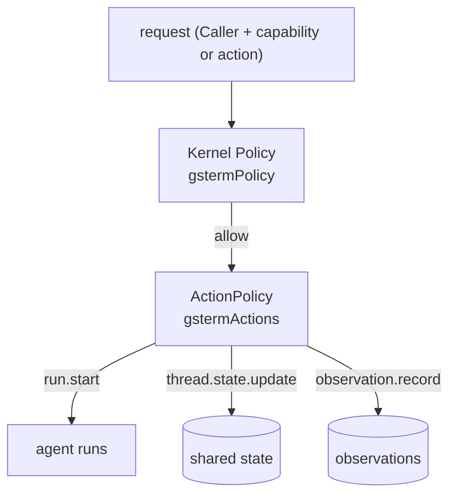

# Authority and policy

Covers `src/app/policy.ts`, `bearerAuthenticator` in `src/server/index.ts`, and the world
registration boundary.

## Purpose

Decide who may do what, explicitly, at the server, with no inference from human privilege. The
human's ability to type arbitrary shell commands never implies machine authority.

## Responsibilities

- Default-deny capability authorization at the kernel boundary.
- Action-level authorization for runs, thread state and observations.
- Recognised-actor and journey-agent allow-lists.
- Separating "who may act" from "who may read".
- Keeping secrets on the provider side.

## Non-responsibilities

- It does not authenticate in the production sense; it maps transport identity to a `Caller`.
- It does not implement per-world policy (debt D-002).
- It does not sandbox the human PTY (debt D-027).

## Position in the system



Both layers are handed to `createRuntime` as `policy` and `actions`.

## Core abstractions

### Actor constants

`human`, `webmcp`, `system` — the only recognised actor ids. The bridge calls in as
`{tenant: "local", actor: {id: "system", kind: "system"}}`.

### Layer 1 — `gstermPolicy()` (kernel capability policy)

Policy id `gsterm-machine-authority-is-explicit`.

Deny unless **both** hold:

1. the actor id is in `GRANTED_ACTORS`;
2. the capability id is in `GRANTED_CAPABILITIES`:

```
process.exec, world.snapshot, focus.search,
code.definition, code.references, code.implementations, code.diagnostics
```

Each denial carries the reason, naming the invariant it enforces.

### Layer 2 — `gstermActions()` (service action policy)

Policy id `gsterm-actions`. Dispatch on the action:

| Action | Rule |
| --- | --- |
| `run.start` | only `agent.execute`, `agent.observe`, `agent.focus` |
| `run.cancel` | allowed for any recognised caller (tenant scoping applies) |
| `thread.state.read` | `session:` or `focus:` prefixed threads only |
| `thread.state.update` | `session:` threads: any recognised actor. `focus:` threads: **human only** |
| `observation.record` | allowed — facts are not actions |
| `remote.offer.*` (publish/list/revoke/invoke) | allowed — an interface-only seam in v0 |
| `continuation.resume` / `.cancel` | allowed for catalogued journeys |
| anything else | denied |

The `focus:` rule is the mechanical form of "SharedFocus is human-governed": an agent may read the
shared focus and propose candidates, and may not write it.

### Layer 3 — transport identity

```ts
Bearer <tenant>:<actorId>[:<kind>]  →  Caller {tenant, actor:{id, kind}}
```

The kind defaults to `user` and is constrained to `user | agent | service | system`. This is a
**development boundary**, labelled as such in code and in the debt ledger (D-026). It is not
production authentication and provides no confidentiality.

### Layer 4 — world registration

World registration is the execution grant. `process.exec` for an unregistered world throws
`WorldUnavailableError` or `unknown execution world`, so "can I run there" and "where is it
registered" are the same question.

### Secrets

`sshAuthOf` is the only place a credential reference becomes a credential. Above it:

- `WorldProvenance.metadata` exposes the authentication *kind* and host-key material, never the
  secret;
- events, world state, projections and WebMCP tool inputs never carry credential values;
- a test asserts the two providers describe themselves without leaking credentials
  (`test/conformance/worlds.test.ts`).

## State

None. Both policies are pure functions over the request.

## Lifecycle

Constructed once at runtime creation and consulted per capability invocation and per action.

## Failure modes

| Symptom | Cause | Meaning |
| --- | --- | --- |
| `actor <id> holds no machine authority` | kernel policy | expected for unknown actors |
| `capability <id> is not granted to this application` | kernel policy | the capability was not added to the allow-list |
| `agent <id> is not a catalogued journey` | action policy | forgot `JOURNEY_AGENTS` |
| `SharedFocus is human-governed` | action policy | an agent tried to accept/pin/reject |
| `state is session/focus-scoped` | action policy | wrong thread prefix |
| `unhandled action` | action policy | an action gs-term does not model |

## Extension points

- **New capability**: add to `GRANTED_CAPABILITIES` (see
  [../how-to/add-a-capability.md](../how-to/add-a-capability.md)).
- **New agent**: add to `JOURNEY_AGENTS`.
- **New actor**: add to `GRANTED_ACTORS` and make sure the bearer kind list matches.
- Per-world authorization is the missing piece; it belongs upstream in Cognate's kernel `Policy`
  rather than in gs-term (debt D-002).

## Source trail

- `src/app/policy.ts` — `gstermPolicy`, `gstermActions`, `GRANTED_ACTORS`, `GRANTED_CAPABILITIES`,
  `JOURNEY_AGENTS`
- `src/server/index.ts:33-42` — `bearerAuthenticator`, `bearerToken`
- `src/app/worlds.ts:19-26` — `sshAuthOf`
- `src/focus/focus.ts` — `requireHuman`, `FocusAuthorityError` (defence in depth)
- `test/app.test.ts` — explicit grants and containment
- `test/focus/focus-lifecycle.test.ts` — action policy denies agent focus writes