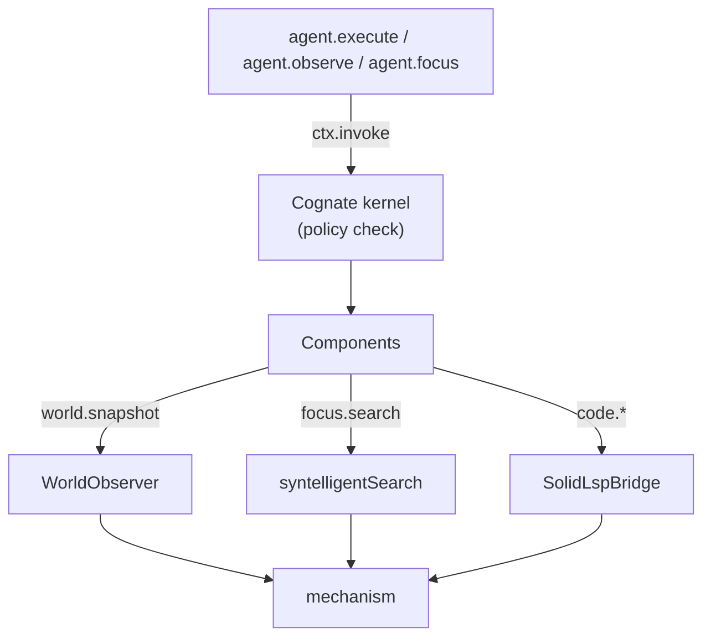

# Capability components

Covers `src/components/observers.ts`, `src/components/focus.ts`, `src/components/code.ts`.

## Purpose

Expose mechanism work as named, versioned, policy-checked capabilities so that agents, the bridge,
the cockpit and WebMCP all reach the same implementation through the same door.

## Responsibilities

- Declare capability contracts (id + version + optional semantic ref).
- Provide implementations on a Cognate fiber during `activate`.
- Validate inputs before any mechanism work.
- Translate between mechanism conventions (0-based positions) and semantic conventions (1-based).

## Non-responsibilities

- They do not decide authorisation; the kernel policy does.
- They do not record events; callers do.
- They do not know which surface invoked them.

## Position in the system

## Core abstractions

### `observersComponent` — `world.snapshot` v1.0.0

Provides one capability for every world. Input `{worldId?}`; default is the session world. Output is
a `WorldSnapshot`. Carries the `controlplane::Evidence` semantic ref when bindings resolved it.

Its implementation is the `WorldObserver` from `src/app/worlds.ts`, which resolves the world through
the registry and fails closed on an unknown or disposed world.

### `focusComponent` — `focus.search` v1.0.0

Input `FocusSearchInput`: `{query, worldId, intent?, snapshot?, focus?, referent?, execution?}`.

The component's job is composition, not search: look up the world's provider and root, ensure the
concept index is fresh (once per runtime, failures swallowed), then call `syntelligentSearch` with
that world's process port, the substrate, the concept store path and the SolidLSP data dir. A world
with no root throws before anything is attempted.

Note `mounted: new Set(["structural-map"])` — the structural map is always considered mounted
because it is derived in-process from the world's own files and processes.

### `codeComponent` — `code.definition`, `code.references`, `code.implementations`, `code.diagnostics` v1.0.0

Input requires `worldId`, `file`, and 1-based `line` and `column`; optional `includeDeclaration`.

The component obtains the SolidLSP bridge for the world, starts the workspace if needed, calls the
operation, and converts 0-based LSP positions to 1-based semantic positions. For a world where
SolidLSP is not mounted it throws
`code capabilities unavailable for world <id> (SolidLSP not mounted)` — never a local fallback.

## Internal operation

Each component follows the same shape: build a contract (id, version, optional `semanticRef`),
declare `provides`, and in `activate` register one handler per contract on the fiber. Handlers
validate first (`parse`), then call mechanism work, then shape the result.

Because handlers are capability invocations, they are subject to the kernel policy — the
`GRANTED_CAPABILITIES` allow-list in `src/app/policy.ts` must include the id or every caller is
denied.

## State

None held between calls, except that the SolidLSP workspace is started on demand and stays warm
(deliberately: first start provisions language-server resources and is slow).

## Lifecycle

Registered once at `createRuntime`. Handlers live for the runtime's lifetime.

## Failure modes

| Symptom | Cause | Behaviour |
| --- | --- | --- |
| `no workspace root for world <id>` | world registered without a root | thrown before search |
| `SolidLSP not mounted` | remote world or mechanisms disabled | explicit; no fallback |
| `code capability requires a 1-based line` | caller used 0-based coordinates | rejected before invoking the bridge |
| `unavailable` for every caller after adding a capability | missing `GRANTED_CAPABILITIES` entry | policy denial (see [../how-to/add-a-capability.md](../how-to/add-a-capability.md)) |

## Extension points

See [../how-to/add-a-capability.md](../how-to/add-a-capability.md). The pattern is fixed: declare a
contract, provide it on the fiber, bind it explicitly, grant it, then expose it through
descriptors. Never call mechanism code directly from an agent.

## Source trail

- `src/components/observers.ts` — `WORLD_SNAPSHOT_CAPABILITY`, `WorldObserver`, `observersComponent`
- `src/components/focus.ts` — `FOCUS_SEARCH_CAPABILITY`, `FocusSearchInput`, `focusComponent`
- `src/components/code.ts` — `CODE_CAPABILITIES`, `CodeInput`, `codeComponent`, position conversion
- `src/app/runtime.ts:86-119` — registration with semantic refs
- `src/app/bindings.ts:39-47` — the binding table
- `src/app/policy.ts:13-21` — the grant allow-list