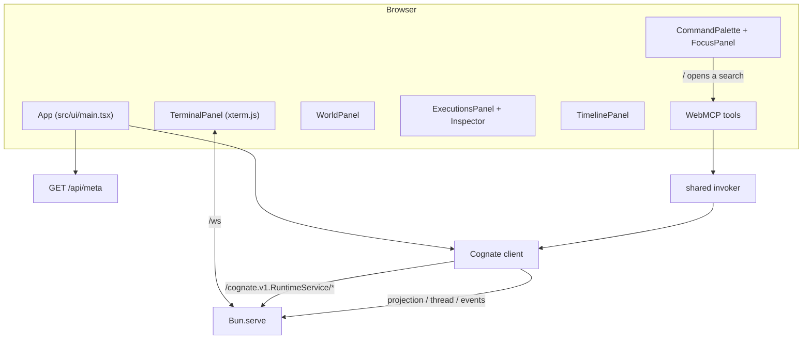

# Cockpit

Covers `src/ui/*`.

## Purpose

Present the semantic world as an operational cockpit, and act as the host surface for WebMCP tool
projection. UI state **projects** durable Cognate state; it is never authoritative.

## Responsibilities

- Render the terminal, world view, execution history, inspector, timeline and focus panel.
- Send input to the PTY over the WebSocket and resize on fit.
- Start structured runs and read projections, shared state and the event stream.
- Install the WebMCP projection at boot.
- Project state, never invent it.

## Non-responsibilities

- It does not derive effects, rank results, or hold focus authority.
- It does not cache semantic truth in React state longer than a subscription lives.
- It does not contain a second invoker.

## Position in the system

The cockpit is served from the same Bun process that hosts the runtime, but runs in the browser.

## Core abstractions

| Module | Role |
| --- | --- |
| `main.tsx` | boot: meta fetch, client, WebMCP projection, render |
| `terminal.tsx` | xterm.js attach, fit/resize, status reporting |
| `world.tsx` | cwd, repository, processes, ports from the world thread |
| `executions.tsx` | execution rows from the `executions` projection |
| `inspector.tsx` | one execution's effects, evidence, output |
| `timeline.tsx` | live event stream, capped |
| `focus.tsx` | `/` command palette, SharedFocus view, candidate list |
| `invoker.ts` | the one invoker shared with WebMCP tools |
| `hooks.ts` | subscription helpers |
| `styles.css` | cockpit styling |

### Data sources

- `client.projection("executions")` — subscribed; rows filtered through `isMarkerKey`.
- `client.threadSharedState(meta.threadId)` — subscribed; renders `WorldStateView`.
- `client.events({follow: true})` — the timeline, capped at 2 000 events in the client (debt D-024).
- The WebSocket — terminal bytes only.

### The one invoker

`createUiInvoker(client, {sessionId, worldId, threadId, surfaceFor})` is constructed once and used
by both the cockpit runner and every WebMCP tool. `surfaceFor` maps `ui → "cockpit"` and
`webmcp → "webmcp"`. This is what makes the two doors converge rather than merely resemble each
other.

### Minimal argv splitting

The structured-run input is split with a small quote-aware splitter rather than a shell parser. It
handles double quotes and spaces; it is not a shell (debt D-024). Structured callers that need
complex argv use the capability or WebMCP tool directly.

## Internal operation

`boot()`:

1. `fetch("/api/meta")` → sessionId, threadId, tenant, world ids, tool descriptors.
2. `connectTransport` + `createRemoteRuntimeService` + `createClient`.
3. Install the WebMCP polyfill if needed; project descriptors; log results.
4. `createRoot(document.getElementById("root")).render(<App …/>)`.

Inside `App`, `useMemo` builds the projection and thread handles once; `useEffect` subscribes to
each. Selected-execution state and the world selector are local UI concerns. A world availability
probe runs on demand when the selector changes (debt D-023).

## State

| State | Owner |
| --- | --- |
| execution rows | projection subscription |
| world view | thread subscription |
| timeline | event subscription, capped |
| selected execution, chosen world, connection status | local React state |
| PTY bytes | the session's scrollback + live stream |

## Lifecycle

Page load → subscribe → user interacts → unsubscribe on unmount. A reload reattaches: the terminal
replays bounded scrollback and the durable projections are re-read.

## Failure modes

| Symptom | Cause | Behaviour |
| --- | --- | --- |
| Terminal stuck at "connecting" | `/ws` upgrade failed | status text shows it; the semantic panels still work |
| WebMCP tools absent | projection failed | console warning; UI renders |
| World view shows `unknown` | an observer could not read a scope | honest; refresh after a command settles |
| Inspector Output reads `unknown` | PTY-observed execution | correct behaviour, not a failure |
| A `run:` key appears in raw projection data | marker keys share the namespace | `isMarkerKey` filters it |
| Timeline stops growing | the 2 000-event client cap | recent behaviour only; history is in the projection |

## Extension points

A new panel reads an existing client handle; a new operation goes through the invoker or a new
descriptor, never a bespoke fetch. Keep `isMarkerKey` filtering wherever raw projection rows are
read.

## Source trail

- `src/ui/main.tsx` — `boot`, `App`, `splitArgs`, polyfill install
- `src/ui/invoker.ts` — `createUiInvoker`, `surfaceFor`
- `src/ui/terminal.tsx`, `world.tsx`, `executions.tsx`, `inspector.tsx`, `timeline.tsx`, `focus.tsx`
- `e2e/acceptance.spec.ts` — acceptance A–G against the real browser
- `test/webmcp/webmcp-projection.test.ts` — the shared invoker contract