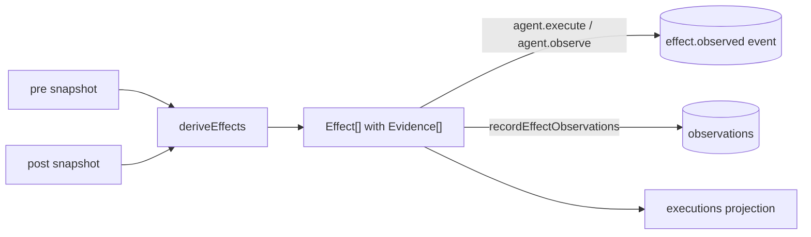

# Effects and evidence

Covers `src/semantic/effects.ts`, `src/semantic/observations.ts`, and the evidence vocabulary in
`src/semantic/contracts.ts`.

## Purpose

Turn two world snapshots into a set of **claims about change**, each one carrying the evidence that
supports it. Never claim a side effect from an exit code; never turn "could not observe" into "no
change".

## Responsibilities

- Diff two snapshots of the same world into `Effect` records.
- Attach evidence to every effect, including the negative case.
- Respect world identity so equal paths in different worlds stay distinct.
- Convert effects and raw facts into observation records.

## Non-responsibilities

- It does not observe anything. Observers do.
- It does not record anything. Agents and the bridge do.
- It does not interpret stdout.

## Position in the system



## Core abstractions

### `Effect`

```ts
{ kind: EffectKind, worldId, target, before?, after?, evidence: Evidence[] }
```

| Kind | Derived from |
| --- | --- |
| `file.created` / `file.modified` / `file.deleted` | file sets and `version`/`size` comparison |
| `git.dirty` / `git.clean` | clean→dirty / dirty→clean transitions, both `observed` |
| `process.started` / `process.stopped` | pid-set diff over the session tree |
| `port.opened` / `port.closed` | `protocol/port/pid` key diff |
| `none` | the explicit negative case |

`worldId` and `target` together are the resource identity. `none` is not a special case in the
diffing code — it is a first-class effect so that "nothing changed" is a recorded, evidenced claim
rather than an absence.

### `Evidence`

```ts
{ what, how, confidence: "observed" | "derived" | "unknown", refs }
```

- **file effects** are `derived` via `how: "snapshot-diff"`, with refs naming both snapshots
  (`<worldId>:<root>@<observedAt>`).
- **git effects** are `observed` via `how: "git-status world=<id>"`, because they rest on a direct
  read rather than a comparison.
- **process effects** are `observed` via `process-tree-diff`; **port effects** via
  `listening-ports-diff`.

### The unknown rule in code

`scopedDiff` returns `[]` unless **both** sides are observed:

```ts
if (!isScoped(pre) || !isScoped(post)) return [];
```

So if the post snapshot could not observe processes, no `process.stopped` is claimed. This is the
single most important line in the file for understanding gs-term's honesty discipline.

### Observation builders

- `effectToObservation(effect, attribution, source, observedAt, key)` — an effect becomes an
  observation with `facts: {before, after}` and the effect's own evidence.
- `factToObservation(kind, subject, facts, source, attribution, observedAt, key)` — a directly
  noticed fact.

Both are pure and framework-free.

## Internal operation

`deriveEffects(pre, post)`:

1. `fileEffects` — build `path → FileObservation` maps from both sides. New path → `file.created`.
   Changed `version` or `size` → `file.modified`. Missing in `after` → `file.deleted`.
2. `gitEffects` — only when both sides are `observed`; emits on a dirty↔clean flip only. Branch
   changes without a dirty flip produce no effect (the repository's *cleanliness* is the tracked
   property; that is a deliberate narrowing).
3. `scopedDiff` twice — processes keyed by pid, ports keyed by
   `protocol/port/pid ?? "unattributed"`.
4. If the result is empty, return a single `none` effect whose evidence also cites the walk method,
   making the claim auditable.

Everything is pure and deterministic: the same two snapshots always yield the same effects.

## State

None. Effects are values; the caller decides whether to emit them as events or observations.

## Lifecycle

Called inside an agent between the two `world.snapshot` invocations.

## Failure modes

| Symptom | Cause | Behaviour |
| --- | --- | --- |
| Effects missing for a scope | one side `unknown` | nothing claimed for that scope; the `none` effect is not emitted either if other scopes produced effects |
| `file.modified` missed | content changed without a `version`/`size` change | the provider's staleness token is the contract; opaque above the provider |
| Effects attributed to the wrong world | snapshots taken from different worlds | resource identity keeps them distinct rather than merging |
| Effects beyond the walk cap | workspace too large | `walk.truncated` is recorded; the gap is unobserved, not false |

## Extension points

Add an `EffectKind`, an evidence-bearing diff, and — if the kind is worth Focus evidence — a place in
`FOCUS_RELEVANT` in `src/bridge/observations.ts`. Keep the both-sides-observed guard.

## Source trail

- `src/semantic/effects.ts` — `deriveEffects`, `fileEffects`, `gitEffects`, `scopedDiff`
- `src/semantic/contracts.ts:112-132` — `EffectKind`, `Effect`, `Evidence`
- `src/semantic/observations.ts` — `effectToObservation`, `factToObservation`
- `src/bridge/observations.ts` — `FOCUS_RELEVANT`, `recordEffectObservations`
- `test/journeys/journey-j6-observations.test.ts` — effects stay observations, causation cited
- `src/semantic/concepts.ts:159-166` — `concept:effects.evidence`