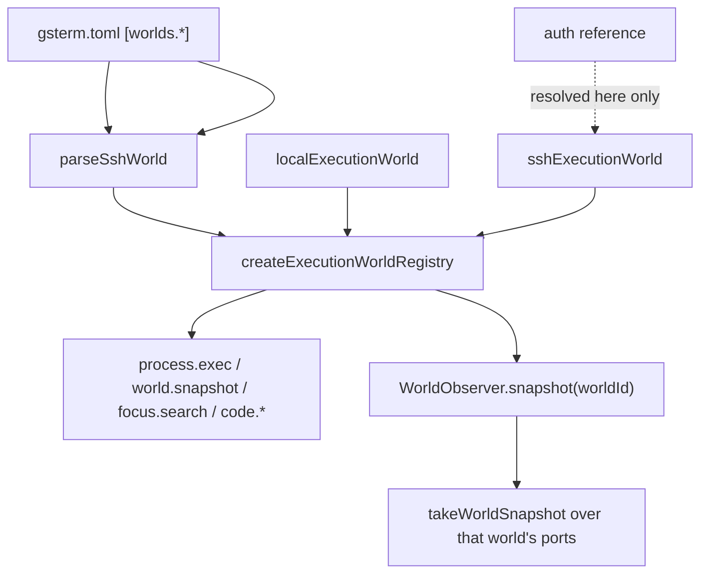

# Execution worlds

Covers `src/app/worlds.ts`, and the world-related parts of `src/config.ts` and
`src/semantic/contracts.ts`.

## Purpose

Let one capability mean the same thing regardless of where it physically runs. `worldId` selects
the provider; the semantic model, event vocabulary and evidence shapes stay identical.

## Responsibilities

- Register exactly one provider per configured world.
- Resolve credential *references* into provider credentials, and only there.
- Build a host-key policy that must be pinned.
- Provide a world-scoped observer over that world's ports.
- Fail closed for unknown worlds.

## Non-responsibilities

- It does not decide whether an actor may use a world (per-world policy does not exist — debt D-002).
- It does not define semantics; nothing here names a provider inside the semantic layer.
- It does not mount the semantic substrate for remote worlds.

## Position in the system



## Core abstractions

### `ExecutionWorlds`

```ts
{ registry: ExecutionWorldRegistry, roots: Record<string, string>, observer: WorldObserver }
```

### Configuration → provider

`worlds.<id>` accepts only `kind = "ssh"` in v0; anything else is a startup error. Required: `host`,
`username`, `root`. `auth` is a **reference**, never a value:

| `auth` value | Resolves to |
| --- | --- |
| `agent` | `{kind: "agent"}` — `SSH_AUTH_SOCK` |
| `key:<path>` | `{kind: "key", privateKeyPath}` |
| `password-env:<VAR>` | `{kind: "password", password: process.env[VAR]}` — throws if unset |

Host-key pinning is mandatory: at least one of `host_key_fingerprints` or `host_keys_file` must be
present, otherwise configuration is rejected at load time. Defaults: port 22,
`default_timeout_ms` 30 000, `ready_timeout_ms` 20 000.

A world id may not collide with the default local world id.

### `WorldObserver`

```ts
snapshot(worldId?) → Promise<WorldSnapshot>
```

- no `worldId` → the session world;
- unknown or disposed world → the registry's `WorldUnavailableError`;
- no configured root for the world → `WorldUnavailableError` with an explicit message;
- `sessionPid` is supplied **only** for the session world, because a process tree is a local-PTY
  concept.

### Resource identity

Every snapshot carries `world: {worldId, kind, metadata}`. Effects and observations carry `worldId`.
Two paths with the same name in two worlds are two resources, and neither merges into the other.

## Internal operation

One local provider is always created for `config.world.id`, rooted at the workspace root. Each
configured SSH world adds an `sshExecutionWorld` built from `sshAuthOf` and `hostKeyPolicyOf`.
Providers go into a single registry; the observer resolves `worldId` through it on every call, so a
provider that has been disposed fails closed rather than serving stale facts.

`roots` comes from `worldRootsOf(config)`: the local world gets the workspace root, each SSH world
gets its configured `root`.

## State

The registry owns live provider connections (SSH sessions). `roots` is immutable configuration.
No semantic state is written here.

## Lifecycle

Created once per runtime, disposed in `GsTermRuntime.close()`. Providers connect lazily on first
use, bounded by `ready_timeout_ms`.

## Failure modes

| Symptom | Cause | Behaviour |
| --- | --- | --- |
| `unsupported kind <k> (v0 supports "ssh")` | config | startup failure |
| `host-key pinning is required` | no fingerprints and no known_hosts | startup failure — deliberate |
| `password-env reference <VAR> is not set` | env missing | thrown when the provider is built |
| `no workspace root configured for world <id>` | world registered without a root | `WorldUnavailableError`, fail closed |
| `unknown execution world: <id>` | an agent asked for an unregistered world | run fails before anything is claimed |
| Remote processes/ports are `unknown` | session-tree attribution is local-only (debt D-010) | reported honestly, never faked |
| `~/.ssh/config` aliases ignored | not implemented (debt D-009) | explicit hosts only |
| Local exec timeout leaves grandchildren | process-group kill divergence (debt D-031) | documented limitation |

## Extension points

A new world kind (WSL, a cloud sandbox, a browser-local Linux) means adding a provider at the
bottom of `src/app/worlds.ts` and, if it needs new configuration, a parser entry in
`src/config.ts`. No semantic-layer change, no new tool, no new event vocabulary. See
[../how-to/add-an-execution-world.md](../how-to/add-an-execution-world.md).

## Source trail

- `src/app/worlds.ts` — `createExecutionWorlds`, `sshAuthOf`, `hostKeyPolicyOf`, `WorldObserver`
- `src/config.ts` — `SshWorldConfig`, `parseSshWorld`, `worldRootsOf`, `workspaceRoot`
- `src/agents/execute.ts:48-52` — world resolution and containment
- `src/agents/observe.ts:49` — the session world for PTY-observed executions
- `src/semantic/contracts.ts:82-98` — `WorldProvenance`, `WorldSnapshot`
- `test/architecture.test.ts:77-83` — the semantic layer may not name a provider
- `test/journeys/journey-j2-worlds.test.ts` — same command, two worlds, distinct resources
- `test/conformance/worlds.test.ts`, `test/support/ssh-fixture.ts` — an in-process SSH fixture