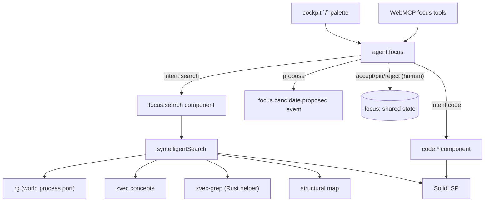

# Focus engine and Syntelligent Search

Covers `src/focus/*`, `src/semantic/focus.ts`, `src/agents/focus.ts`, `src/components/focus.ts`,
`src/components/code.ts`.

## Purpose

Deterministically reduce the computational world to the smallest useful working set around the
human's goal and current attention, and answer contextual questions with a bounded result set plus
an inspectable receipt. No language model is involved.

## Responsibilities

- Capture and resolve attention with a fixed precedence.
- Maintain the human-governed SharedFocus and the FocusCandidate lifecycle.
- Route a query to the fewest mechanisms that can answer it.
- Verify retrieved candidates against the world before claiming them.
- Reduce affordances to precise semantic operations for a focused entity.
- Expose precise code capabilities (`code.*`) as capabilities, not as ad-hoc lookups.

## Non-responsibilities

- It does not record rankings or derivations as observations.
- It does not change SharedFocus on an agent's behalf.
- It does not cross worlds silently.

## Position in the system



## Core abstractions

### Attention

`HumanAttention` / `AgentAttention` are transient. `resolveAttention` applies a fixed precedence,
highest first:

```
explicit-selection → selected-text → focused-object → keyboard-focus →
pointer-dwell → pointer-at-open → active-execution → shared-focus →
recent-interaction → workspace-fallback
```

Never a numeric confidence score. The resolution binds to semantic entity identity
(`EntityRef`), never a DOM selector.

### `AttentionSnapshot`

Frozen when `/` opens. It records the world, workspace, SharedFocus version, referent, pointer
entity, active execution, active panel, and the provenance of the resolution. Because it is frozen,
moving the pointer afterwards cannot silently change what "this" referred to — the search resolves
against the captured world and entity unless the user refreshes.

### SharedFocus

```ts
{ sessionId, worldId, workspace, version, goal?, primary?, pinned[], workingSet[],
  unresolved[], evidence[], validation?, updatedAt }
```

### FocusCandidate

```ts
{ id, worldId, workspace, proposedEntity, proposedGoalDelta?, reason, evidence[],
  expectedValue?, suggestedNextActions[], sourceAgent, status, evidenceToken,
  createdAt, resolvedAt?, resolvedBy? }
```

Lifecycle: `proposed → accepted | pinned | rejected | superseded`. `rejectCandidate` marks the
candidate; the same proposed entity with the same `evidenceToken` cannot be reproposed without
materially new evidence.

### Affordances

`affordancesFor(entity)` returns actions keyed by entity kind — a `CodeSymbol` offers *Go to
definition* (`code.definition`) and *Trace references* (`code.references`); a `ListeningPort` offers
*Reveal owning execution*; a `Diagnostic` offers *Go to cause* and *Affected tests*. Each names a
**semantic operation**, never a screen location, so human and machine see the same actions.

### `agent.focus` intents

| Intent | Effect |
| --- | --- |
| `search` | invokes `focus.search`; emits `focus.search.completed`; returns results + receipt |
| `code` | invokes `code.definition` / `references` / `implementations` / `diagnostics`; emits `focus.code.completed` |
| `propose` | emits `focus.candidate.proposed`; **SharedFocus unchanged** |
| `inspect` | read-only: goal, primary, pinned, working set, unresolved, version, affordances |
| `accept` / `pin` / `reject` | human-only transitions via `ctx.updateSharedState` |

### Syntelligent Search routing

`detectIntent` maps a query to one of: `who-calls-this`, `why-did-this-fail`, `related-tests`,
`changed-recently`, `what-opened-this-port`, `architecture`, `what-is-this`, `semantic`.

Routing is reduction — each query runs the fewest mechanisms that can answer it:

| Intent | Path |
| --- | --- |
| `why-did-this-fail` | execution evidence first; then bounded code retrieval |
| `who-calls-this`, `what-is-this` | coordinate-first SolidLSP; rg only as a **stated fallback** |
| exact identifier | rg, bounded |
| `architecture` | concepts + structural scope, then **stop** (no source retrieval) |
| `semantic` | concepts → structural scope → zvec-grep → rg snippet verification |

Symbol target resolution is tiered, and the tier is recorded as receipt provenance
(`exact-coordinate` > `document-refined` > `workspace-symbol` > `declaration-fallback`):

1. exact `path:line:column` on the referent → straight to SolidLSP, no discovery at all;
2. `path:line` → read that one line through the world port, locate the identifier; if ambiguous,
   file-local document symbols;
3. name only → `workspaceSymbols` with bounded retries (a cold tsserver may report empty or
   "No Project"), then rg purely as a *position finder*, then warm the document before asking.

### `SearchReceipt`

The answer to "why these?". It carries: detected intent, the availability snapshot for this world,
every stage that ran with its true candidate count, the reduction funnel
(`workspace → focusScope → structural → semantic → verified`), the results, and
`provenance: {method, crossWorld: false}`.

A stage that did not run is never listed. Unavailable mechanisms are reported in `availability`
with a reason, and local results are never substituted for a remote world.

## Internal operation

`syntelligentSearch` first probes substrate clients (`helper.ensureStarted`, `modelStatus`,
`solidlsp.ensureStarted`, `startWorkspace`), degrading to `{}` on failure — availability is
*observed*, not assumed. It then resolves availability, builds the structural map if needed,
narrows `focusScope` using the referent's directory or concept links, and executes the stages for
the detected intent, pushing onto `stages` as it goes.

Retrieval candidates from zvec-grep are ranked by engine order, boosted when the file is linked from
a retrieved concept, and then **verified**: the snippet must actually exist on disk (an `rg -F` of
a distinctive slice inside that file). Unverified candidates are dropped and the receipt's
`verified` count reflects what survived.

## State

| State | Where |
| --- | --- |
| SharedFocus | durable shared thread state on the focus thread |
| Attention | ephemeral, in the UI process |
| AttentionSnapshot | ephemeral, held by the open search |
| Concept store | `<dataDir>/concepts` with a `.digest` marker |
| Structural map | per request unless supplied by the caller |

## Lifecycle

A search: capture snapshot → resolve referent → detect intent → probe → reduce → verify → receipt.
A focus change: propose (no state change) → human resolves → SharedFocus version increments → the
next search records the new `sharedFocusVersion` in its receipt.

## Failure modes

| Symptom | Cause | Behaviour |
| --- | --- | --- |
| `who calls this?` returns only rg hits | SolidLSP not mounted for this world | the reason is stated in the result and the availability list |
| `who calls this?` takes ~40 s | cold tsserver on the first references ask | bounded retries with warm-up; subsequent queries are ~1 s (measured by `journey-j9` tests) |
| Semantic query returns nothing | concept store missing or zvec-grep absent | degrades to rg, bounded; availability says why |
| Agent tried to accept a candidate | `FocusAuthorityError` and/or action policy denial | SharedFocus unchanged |
| Identical rejected candidate re-proposed | same `evidenceToken` | blocked |
| `cd` never appears in effects | shell builtins change the world without file/process diffs | cwd comes from shell integration markers instead |

## Extension points

- **New mechanism**: add a name to `MechanismName`, report it honestly in `resolveAvailability`,
  and use it in a routing branch. Do not invent a search verb.
- **New intent**: extend `SearchIntent`, add a `detectIntent` rule, add a routing branch, and record
  the stages.
- **New affordance kind**: extend the `affordancesFor` switch, naming a capability id.
- **New concept**: add to `src/semantic/concepts.ts`; the digest forces a store rebuild. See
  [../how-to/add-a-concept.md](../how-to/add-a-concept.md).

## Source trail

- `src/focus/search.ts` — `syntelligentSearch`, `detectIntent`, `resolveSymbolTarget`, the receipt
- `src/focus/mechanisms.ts` — `resolveAvailability`, `rgSearch`, `buildStructuralMap`,
  `declarationPattern`, `declarationColumn`
- `src/focus/focus.ts` — `acceptCandidate`, `pinEntity`, `rejectCandidate`, `requireHuman`
- `src/focus/attention.ts` — `ATTENTION_PRECEDENCE`, snapshot resolution
- `src/focus/affordances.ts` — `affordancesFor`
- `src/focus/concept-index.ts` — `ensureConceptIndex`, `conceptQueryFor`
- `src/agents/focus.ts` — the intent dispatch
- `src/components/focus.ts`, `src/components/code.ts` — the capability components
- `src/semantic/focus.ts` — every shape above
- `test/focus/*.test.ts`, `test/journeys/journey-j9-semantic-reduction.test.ts`