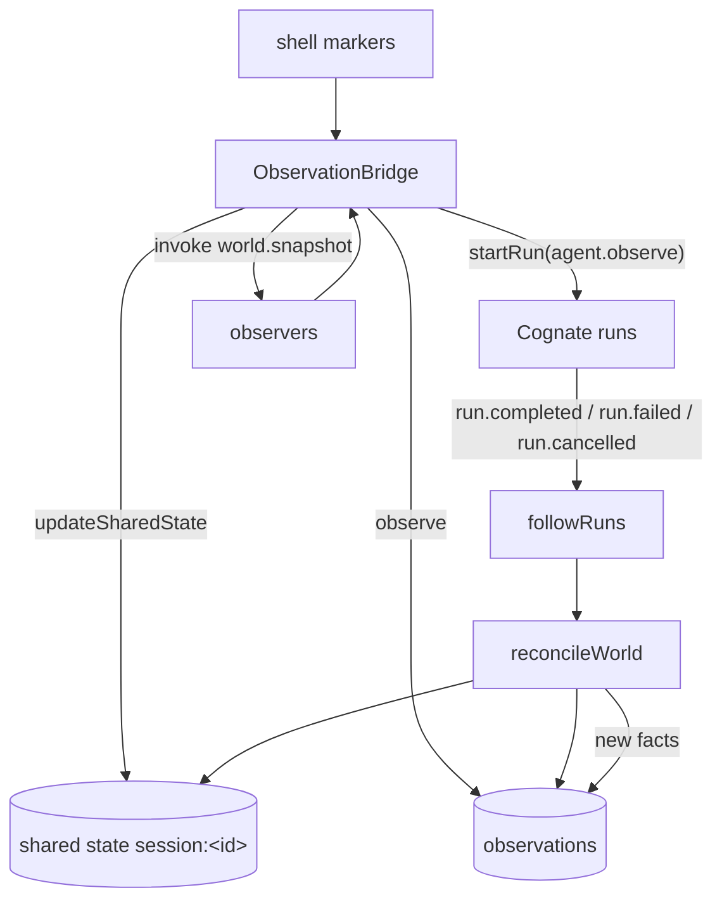

# Observation bridge

Covers `src/bridge/observation.ts`, `src/bridge/observations.ts`.

## Purpose

Be the single adapter between the Cognate-free mechanism layer and the semantic world. It turns
shell markers into catalogued journey runs, and turns discovered world facts into observations.
It never writes events directly — agent runs are Cognate's only door to durable truth.

## Responsibilities

- Track command boundaries from shell markers and capture a pre-snapshot per command.
- Start `agent.observe` runs with the command facts and pre-snapshot attached.
- Follow durable run settlements for the session correlation and reconcile world state after each.
- Write the versioned world view to shared thread state with optimistic concurrency.
- Record newly discovered facts (new ports, a newly dirty tree) as run-less observations.
- Preserve `unknown` when an observer could not establish something.
- Own the world-state thread id.

## Non-responsibilities

- It does not derive effects. Agents do that.
- It does not render, and it does not talk to the PTY beyond markers.
- It does not perform actions on behalf of anyone.

## Position in the system



## Core abstractions

### Marker handling

```
R → make sure a pre-snapshot is in flight
A → remember the command; make sure a pre-snapshot is in flight
D → lastCwd = marker.cwd; rotate the pre-snapshot IMMEDIATELY;
    then enqueue recordObservation(command, D, previous pre-snapshot)
```

The rotation is synchronous and deliberate: the next command's pre-state must start at *this*
prompt, so the snapshot for command N+1 must be taken before command N+1's marker arrives. If a
command produced no `A` marker, the `D` handler still rotates and records nothing.

`lastCwd = marker.cwd` handles shell builtins: `cd` changes the world, and no file/process effect
would show that, so the cwd is taken from the shell integration rather than from a diff.

### `recordObservation` (J1)

Builds the `agent.observe` input — observationId, sessionId, command, cwd, exit code, start/end ISO
timestamps, the pre-snapshot, `source: "pty"`, `surface: "terminal"` — and starts the run with an
idempotency key `observe:<sessionId>:<observationId>` and correlation `session:<sessionId>`.

### `followRuns`

Subscribes to `service.events({follow: true})` filtered to the session correlation prefix, and
reacts to `run.completed`, `run.failed` and `run.cancelled`. For an `agent.observe` completion it
passes the run output through so the reconciled world state can record the execution as
`lastExecution`.

### `reconcileWorld` (J3)

1. Take a fresh snapshot.
2. Read the current shared state for `session:<id>`.
3. `buildWorldState` — cwd from `lastCwd` → previous state's cwd → configured root; terminal info
   from the live session; repository/processes/ports from the snapshot; `lastExecution` from the
   triggering run output, falling back to the prior value.
4. Write with `expectedVersion` (see below).
5. `recordDiscoveredFacts`.

### `writeWorldState`

Optimistic concurrency: read the current version, attempt the update, and on a version conflict
re-read and retry up to five attempts. Any other error is reported through `onError` and gives up.
Idempotency key is `world:<sessionId>:<uuid>` per attempt.

### `recordDiscoveredFacts`

Reality facts found *outside* any execution, recorded as first-class observations rather than
fabricated runs:

- a listening port that was not in the previous state → `port.available`
- a working tree that went from clean to dirty → `git.dirty`

Attribution is `correlated` to the session thread with confidence `observed`; the **cause stays
null** — the system noticed, it did not cause. Both are bounded (only new or changed facts) and
idempotent per `(fact, snapshot)`, so a retry cannot double-record.

### Effect→observation fan-out (`src/bridge/observations.ts`)

`recordEffectObservations` promotes high-value *derived* effects into the observation log so they can
serve as Focus evidence. Only the kinds in `FOCUS_RELEVANT` are fanned out — `none` and noise are
excluded. Each becomes an observation correlated to its execution, `caused` when a cause event id
was supplied and `correlated` otherwise, with a stable idempotency key
`effect:<executionId>:<kind>:<worldId>:<target>:<index>`. Idempotent replay or transient contention
is swallowed: a second fact is never fabricated.

## Internal operation

All bridge work is serialised through a promise chain (`enqueue`). Reconciliation therefore happens
in order and cannot interleave with a command observation. Errors in the chain are reported through
`onError` and never break subsequent work.

Snapshots that are rotated away are protected with a no-op `catch` so shutdown races cannot surface
as unhandled rejections.

`close()` sets `closed`, aborts the follower, and drains the chain.

## State

| State | Lifetime | Owner |
| --- | --- | --- |
| `pendingCommand` | one command | bridge |
| `pendingPre` | one snapshot promise | bridge |
| `lastCwd` | session | bridge (authoritative cwd source) |
| `chain` | process | bridge (serialisation) |
| world view | durable, versioned | Cognate shared state |
| observations | durable | Cognate observation log |

## Lifecycle

Constructed after the runtime, before transports. `attach({marker})` wires the session's markers;
`startFollower()` begins durable-run reconciliation; `reconcile("boot")` establishes the initial
world view.

## Failure modes

| Symptom | Cause | Behaviour |
| --- | --- | --- |
| Repeated `bridge-chain` errors | a capability threw (policy denial, unknown world) | reported, chain continues |
| `world-state <trigger>` error after 5 attempts | sustained version conflict or a store error | gives up; the next trigger retries |
| `record-fact` errors | observation ingestion rejected the record | reported, never retried in a loop |
| `followRuns` error | the event stream broke | reported; reconciliation then only happens on attach/boot |
| `unknown` in the world view | an observer could not read a scope | retained honestly; the prior observed value is kept when available rather than flipped to false |

## Extension points

New discovered-fact kinds belong in `recordDiscoveredFacts`; new fan-out kinds belong in
`FOCUS_RELEVANT`. Neither needs Cognate knowledge beyond the `observe` door.

## Source trail

- `src/bridge/observation.ts` — `ObservationBridge`, `handleMarker`, `recordObservation`,
  `followRuns`, `reconcileWorld`, `recordDiscoveredFacts`, `writeWorldState`, `threadId`
- `src/bridge/observations.ts` — `recordEffectObservations`, `FOCUS_RELEVANT`
- `src/semantic/observations.ts` — `effectToObservation`, `factToObservation`
- `src/observers/snapshot.ts` — `buildWorldState`
- `src/agents/observe.ts` — the run this bridge starts
- `src/semantic/contracts.ts` — `WorldStateView`, `ObservationRecord`
- `test/journeys/journey-j3-world-state-reconciliation.test.ts` — reconciliation, `cd` builtin effect
- `test/journeys/journey-j6-observations.test.ts` — facts without runs, cited causation, identity