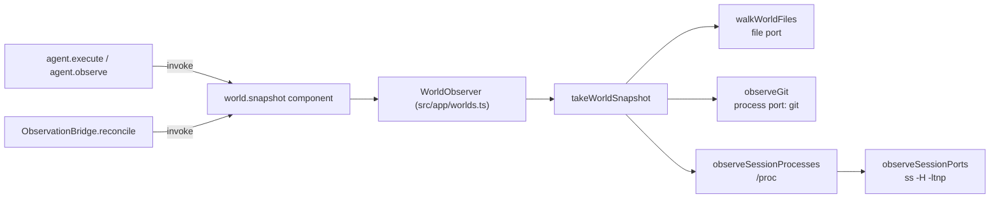

# Observers and world snapshots

Covers `src/observers/snapshot.ts`, `filesystem.ts`, `git.ts`, `processes.ts`, `ports.ts`, and the
`world.snapshot` capability component.

## Purpose

Produce one coherent, provenance-bearing snapshot of an execution world — files, repository state,
session processes, session-attributed ports — through that world's own ports, so a local workspace
and a remote host yield the same evidence shapes.

## Responsibilities

- Walk a world's filesystem with a hard entry cap and explicit truncation reporting.
- Read repository facts through the world's process port using the `git` CLI.
- Collect the session's process tree from `/proc`.
- Attribute listening ports to that process tree via `ss`.
- Assemble the snapshot and fold it into a world state view.
- Report `unknown` with a reason instead of guessing.

## Non-responsibilities

- It does not compare snapshots. That is `deriveEffects` in the semantic layer.
- It does not record anything in the log.
- It does not render or scrape terminal output.

## Position in the system

`world.snapshot` is the only evidence-gathering capability. Three callers: `agent.execute`,
`agent.observe`, and the bridge's reconciliation path.



## Core abstractions

### `WorldSnapshot`

```ts
{ observedAt, world: WorldProvenance, root,
  walk: { method, truncated, excluded },
  files: FileObservation[],
  git: GitObservation,
  processes: Scoped<ProcessObservation>,
  ports: Scoped<PortObservation> }
```

`WorldProvenance` names the world id, kind and provider-safe metadata (host, port, username, auth
kind, host key) — never credentials.

`Scoped<T>` is the honesty type: either `ScopeObservation<T>` (observed, with `observedAt` and
`method`) or `UnknownScope` (`reason`). `isScoped()` narrows it.

### Structural ports

The mechanism layer observes **any** world through two small interfaces that Cognate's providers
already satisfy:

```ts
interface FilePort   { stat(path): …; list(path): … }
interface ProcessPort{ exec({argv, cwd, timeoutMs}): … }
```

This is why observers work unchanged over SFTP and a remote shell.

### Observer specifics

| Observer | Mechanism | Notable behaviour |
| --- | --- | --- |
| `walkWorldFiles` | `FilePort.list` / `stat` | recursive, capped at 5 000 entries, excludes `.git`, `node_modules`, `.cognate`; sets `truncated: true` at the cap; an unreadable directory is skipped, never claimed absent |
| `observeGit` | `git -C <root> rev-parse --show-toplevel`, `branch --show-current`, `status --porcelain` | three distinct statuses: `observed`, `no-repo`, `unknown`; porcelain v1 lines are sliced at the 3-char `XY ` prefix |
| `observeSessionProcesses` | reads `/proc/*/stat` | breadth-first over ppid edges from the session root pid; `unknown` when there is no root pid, `/proc` is unavailable, or the root is gone; `comm` is parsed after the last `)` because it may contain spaces and parens |
| `observeSessionPorts` | `ss -H -ltnp` | **only** ports whose pid is in the session tree are claimed; an unattributable listener is left unclaimed, because absence of attribution is not absence of the port |
| `takeWorldSnapshot` | orchestrates the above | files/git/processes in parallel, then ports from the process pid set; stamps the world id into the walk method |

`buildWorldState` folds a snapshot plus session facts into the `WorldStateView` written to shared
thread state.

## Internal operation

`takeWorldSnapshot` runs three observers concurrently, then derives the port attribution set from
whatever the process observer could establish. If processes were `unknown`, the pid set is empty,
and the port observer returns `unknown` with the reason "no observed session processes to attribute
ports to" — the honest chain rather than a fabricated empty list.

This is also why remote worlds report processes and ports as `unknown`: session-tree attribution is
a local-PTY concept (debt D-010). Files and git still work over SFTP and the remote process port.

## State

Stateless. Reads the world; writes nothing. Snapshots are passed by value into agents and the
bridge.

## Lifecycle

Per invocation. Cost is dominated by the `git` status call and the filesystem walk; both are
bounded.

## Failure modes

| Symptom | Cause | Result |
| --- | --- | --- |
| `walk.truncated` is true | workspace exceeds 5 000 entries | effects may miss changes past the cap (debt D-019) |
| `processes.status` is `unknown` | no session pid yet (startup race) | ports become `unknown` too; effect diffing skips those scopes rather than claiming no change |
| `git.status` is `no-repo` | workspace root is not a work tree | `gitEffects` produces nothing |
| `git.status` is `unknown` | `git status` failed or git is absent | reported with the reason |
| A port never appears | it could not be attributed to the session tree | deliberately unclaimed |

## Extension points

To observe a new scope: add it to `takeWorldSnapshot`, give it a `Scoped<T>` shape with an
`unknown` branch, and add the corresponding diff in `deriveEffects`. Keep the structural-port style —
do not import Cognate into `src/observers/`, or the architecture test fails.

## Source trail

- `src/observers/snapshot.ts` — `takeWorldSnapshot`, `buildWorldState`
- `src/observers/filesystem.ts` — `walkWorldFiles`, `DEFAULT_EXCLUDED`, `DEFAULT_MAX_ENTRIES`
- `src/observers/git.ts` — `observeGit`, the three-status rule
- `src/observers/processes.ts` — `observeSessionProcesses`, `readAllStats`
- `src/observers/ports.ts` — `observeSessionPorts`, `parseSsOutput`
- `src/components/observers.ts` — `WORLD_SNAPSHOT_CAPABILITY`, `WorldObserver`, `observersComponent`
- `src/app/worlds.ts` — the `WorldObserver` implementation bound to providers
- `test/journeys/journey-j3-world-state-reconciliation.test.ts` — repo facts, ports, honesty
- `test/journeys/journey-j2-worlds.test.ts` — remote evidence gathered, not inferred