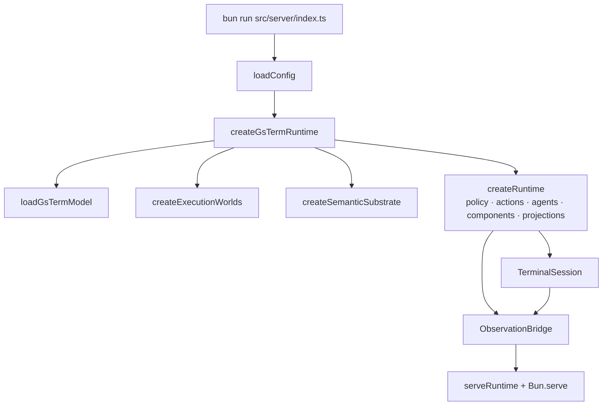

# Runtime composition

Covers `src/config.ts`, `src/app/runtime.ts`, `src/server/index.ts`, `src/app/bindings.ts`.

## Purpose

Compose the mechanism layer into Cognate exactly once, in one process, in a defined order — and
make every semantic-to-capability binding explicit rather than inferred.

## Responsibilities

- Reading configuration from `gsterm.toml` plus environment overrides.
- Loading and validating the semantic domain model.
- Binding semantic objects to capability contracts (`bindCapabilities`, one call site).
- Creating the execution-world registry, the semantic substrate, and the Cognate runtime.
- Registering journey agents, capability components and the public projection.
- Serving the cockpit, the WebSocket terminal, the Connect transport and the health/meta endpoints.
- Deterministic startup and teardown.

## Non-responsibilities

- It does not implement mechanisms (see [terminal-session.md](terminal-session.md),
  [observers.md](observers.md)).
- It does not contain provider mechanics beyond selecting providers
  ([execution-worlds.md](execution-worlds.md)).
- It does not decide grants (see [authority-and-policy.md](authority-and-policy.md)).

## Position in the system

`src/server/index.ts` is the entry point. It calls `createGsTermRuntime` (from
`src/app/runtime.ts`), then builds a `TerminalSession` and an `ObservationBridge` around the
runtime's service, then serves HTTP/WS.



## Core abstractions

### `GsTermConfig`

Fully resolved, defaults applied. Loaded by `loadConfig(cwd)`:
`gsterm.toml` → environment overrides → built-in defaults. Non-empty `world.root` is resolved to
an absolute path; empty stays empty and resolves to the process cwd via `workspaceRoot`.

Helper accessors: `mechanismsOf`, `mechanismDataDir`, `workspaceRoot`, `worldRootsOf`.

Full key reference: [../reference/configuration.md](../reference/configuration.md).

### `GsTermRuntime`

The composition result: the Cognate `Runtime`, the execution worlds, the semantic model, the
workspace root, the substrate, and a `close()` that closes the runtime, disposes the world registry
and disposes the substrate.

### `SemanticModel`

The parsed projection plus its digest, the bound capability contracts, and convenience refs
(`executionSemanticRef`, `evidenceSemanticRef`, `focusSemanticRef`, `codeSemanticRef`,
`diagnosticSemanticRef`). Refs are attached to component contracts so capability invocations carry
their semantic identity.

### Explicit bindings

```ts
{ semanticId: "controlplane::Execution",  capability: { id: "process.exec",    version: … } }
{ semanticId: "controlplane::Evidence",   capability: { id: "world.snapshot", version: … } }
{ semanticId: "controlplane::Syntelligent Search", capability: { id: "focus.search", version: … } }
{ semanticId: "controlplane::Code Symbol", capability: { id: "code.definition" | "code.references" | "code.implementations" } }
{ semanticId: "controlplane::Diagnostic",  capability: { id: "code.diagnostics" } }
```

Required ids are checked before binding; a missing one fails startup with the model path in the
message. Nothing is inferred: a capability with no binding simply has no semantic ref.

### Component wiring in `createGsTermRuntime`

| Component | Provides | Mechanism behind it |
| --- | --- | --- |
| `executionWorldsComponent` | `process.exec` + world registry | the registry in `src/app/worlds.ts` |
| `observersComponent` | `world.snapshot` | `takeWorldSnapshot` over the world's ports |
| `focusComponent` | `focus.search` | `syntelligentSearch` with the world's process port + substrate |
| `codeComponent` | `code.*` | `SolidLspBridge` (local world only) |

### HTTP surface

| Route | Purpose |
| --- | --- |
| `GET /` | inline HTML shell loading `/app.css` and `/app.js` |
| `GET /app.js`, `GET /app.css` | browser bundle, built at startup with `Bun.build` |
| `GET /health` | session liveness/dimensions/exit, semantic object count + digest, capability names, workspace root |
| `GET /api/meta` | session/thread/tenant ids, world list, and the WebMCP tool descriptors with input schemas |
| `GET /ws` | terminal WebSocket upgrade |
| `/cognate.v1.RuntimeService/*` | reverse-proxied to the internal Connect server |

A store path failure or a UI bundle failure aborts startup rather than serving a degraded server.

### WebSocket protocol

- On open: a `session` control frame with id, dimensions, alive flag and exit code; then bounded
  scrollback replay; then live bytes as binary frames.
- From the client: JSON strings are control frames (`resize`, `ping`); binary frames are keystrokes
  written straight to the PTY.
- On close: detach listeners. The session survives — it belongs to the server, not the viewer.
- Every attach triggers `bridge.reconcile("attach")` so the world view is re-derived from observed
  facts rather than trusted from a previous view.

## Internal operation

Startup order is model → runtime → session → bridge → transports; teardown reverses it. This is
stated in the module header and is load-bearing: the bridge needs a session pid provider that does
not exist yet at runtime-construction time, so it is supplied as a closure (`() => session?.shellPid`).

Concept-index freshness is resolved once per runtime, lazily: the first focus search calls
`ensureConceptIndex`, memoises the promise, and swallows failures — a failed substrate must never
fail the search path.

## State

Owns the Cognate store handle, the world registry and the substrate handle. It does not own world
state (the bridge writes that) or the PTY (the session owns that).

## Lifecycle

Created per server process. `stop()` closes in reverse order: bridge (stop the event follower, drain
the serialised chain) → session (close the PTY, `SIGTERM` then `SIGKILL` after 2 s) → HTTP server
(`stop(true)`, dropping connections) → Connect server → app (runtime, worlds, substrate).

`SIGINT`/`SIGTERM` handlers call `stop()` then exit 0.

## Failure modes

| Symptom | Cause | Recovery |
| --- | --- | --- |
| Startup throws `failed to parse domain model` | `domain/interaction-model.sea` invalid | fix the model; check `.sea/interaction/validation/` |
| Startup throws `missing required semantic object` | a required id was removed from the model | restore the id or update `SEMANTIC_ID_*` deliberately |
| Startup throws `failed to bundle cockpit UI` | a UI import error | read the bundled log in the thrown message |
| `worlds.<id>` collides with the local world id | config error | rename the world |
| SSH world `auth` reference not set | `password-env:<VAR>` variable missing | export it before starting |

## Extension points

Adding a capability, agent, world or surface does **not** change this file's structure — it means
adding entries to the existing arrays. See [../how-to/add-a-capability.md](../how-to/add-a-capability.md).

## Source trail

- `src/config.ts` — `GsTermConfig`, `loadConfig`, `parseSshWorld`, `worldRootsOf`
- `src/app/runtime.ts` — `GsTermRuntimeOptions`, `createGsTermRuntime`, `ensureConcepts`
- `src/app/bindings.ts` — `SEMANTIC_ID_*`, `loadGsTermModel`, `bindCapabilities`
- `src/server/index.ts` — `startServer`, `bearerAuthenticator`, `websocketHandlers`, `health`
- `src/terminal/protocol.ts` — control frame encode/decode
- `test/app.test.ts` — config and binding assertions