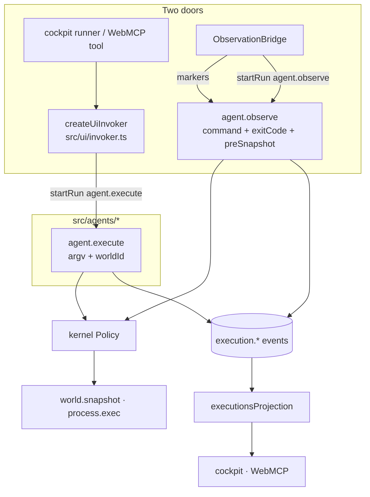

# Semantic execution

Covers `src/agents/execute.ts`, `src/agents/observe.ts`, `src/agents/shared.ts`,
`src/projections/executions.ts`.

## Purpose

Turn "something ran" into durable, inspectable semantic executions — from either door — and fold
those events into a read model that answers "what ran, where, and what did it change".

## Responsibilities

- Validate agent input deterministically, before any side effect.
- Contain `cwd` inside the world's root.
- Emit the shared execution event vocabulary.
- Snapshot before and after, derive effects, emit them with evidence.
- Capture output for structured runs; declare `unknown` for PTY runs.
- Emit an explicit non-settlement when a run cannot complete.
- Maintain the `executions` projection and the run→execution identity bridge.

## Non-responsibilities

- It does not touch the PTY, the filesystem directly, or `ssh` in any form.
- It does not rank, search, or write focus state.

## Position in the system

Both agents are registered in `createGsTermRuntime`. `agent.execute` is started by the cockpit
runner and by WebMCP tools through the shared invoker; `agent.observe` is started only by the bridge.

## Core abstractions

### `agent.execute` (J2)

Input: `{argv, cwd?, worldId?, source, surface, requestedBy, timeoutMs?}`.

1. Validate: non-empty argv of non-empty NUL-free strings; `source ∈ {ui, webmcp, pty}`.
2. Resolve the world (default world id when empty); **fail closed** if the world has no root.
3. Contain `cwd` with `resolveLocal(worldRoot, cwd)` — string math, before invocation (debt D-003:
   `process.exec` does not canonicalise paths, so containment is the caller's job).
4. `executionId` via a recorded step, `startedAt` via a recorded step. Nondeterminism only ever
   through `ctx.step`, so runs are replayable.
5. Emit `execution.started`.
6. Invoke `world.snapshot` (pre) and shape-check it.
7. Invoke `process.exec` with `{worldId, argv, cwd, timeoutMs}`.
8. Invoke `world.snapshot` (post).
9. `deriveEffects(pre, post)` → emit `effect.observed`.
10. Emit `execution.completed` with real output (truncated at 64 KiB), duration, `effectsCount`,
    `settled: "derived"`.
11. Return a structured result containing the full effect list.

On any failure: emit `execution.failed` (best effort — an aborted run blocks `ctx.emit` by design)
and rethrow so the run status stays `failed`. The semantic world therefore records an explicit
non-settlement rather than silence.

### `agent.observe` (J1)

Input: `{observationId, sessionId, command, cwd, exitCode, startedAt, endedAt, preSnapshot,
source: "pty"}`.

Structurally identical from `execution.started` onward, with three differences that are metadata and
honesty, not ontology:

- the execution id is the observation id supplied by the bridge;
- only a **pre** snapshot is supplied, so the post snapshot is invoked at settlement time;
- `output` is the literal `"unknown"` and `settled` is `"observed"`.

The agent rejects any input whose `source` is not `pty` — the human door is not a free-form API.

### Shared helpers (`src/agents/shared.ts`)

`json()` (the single cast point for event payloads), `renderCommand()` (shell-ish rendering with
JSON quoting for arguments containing whitespace/quotes/backticks), `truncateOutput()` (64 KiB cap
with an explicit truncation notice), `isWorldSnapshot()` (shape guard), `requireString`,
`requireArgv`.

### `executionsProjection`

A deterministic fold of `execution.started`, `effect.observed`, `execution.completed`,
`execution.failed`, plus `run.failed` and `run.cancelled`.

Key design points:

- **Tenant partition.** Public projections key as `<tenant>/<executionId>`; the runtime's read filter
  depends on it. Bumping the projection version invalidates stale checkpoints.
- **Run identity bridge.** `execution.started` also writes a `run:<runId>` marker key holding the
  execution id, so a runtime-level `run.failed` — which only knows the run — can find its execution
  entry. Consumers must ignore `run:`-prefixed keys; `isMarkerKey()` exists for that.
- **Status field.** `started → settled | failed | cancelled`.
- **Rebuildable.** The projection is never authoritative; it can be recomputed from the log.

## Internal operation

Both agents are linear and deterministic apart from recorded steps. There is no retry logic inside
an agent: a failure is settled explicitly and propagated. Retry and degradation decisions belong
upstream (the search planner, the substrate probes).

## State

Agents are stateless definitions. They write events through `ctx.emit` and read capability results
through `ctx.invoke`. The projection holds derived state under the runtime's management.

## Lifecycle

`startRun` → run starts → agent emits `execution.started` → … → emits `execution.completed` or
`execution.failed` → run status `completed`/`failed` → projection applies events → the bridge's
follower notices `run.completed` for the session and reconciles world state.

## Failure modes

| Symptom | Cause | Behaviour |
| --- | --- | --- |
| `unknown execution world: <id>` | world not registered | run fails before `execution.started`; nothing is claimed |
| Containment failure on `cwd` | resolved path outside the world root | fails closed before invocation |
| `world.snapshot returned an unexpected shape` | a provider misbehaved | run fails; no effects invented |
| Policy denial | actor or capability not granted | run never starts; no events |
| Output truncated | stdout/stderr over 64 KiB | truncation is announced in the payload text |
| Run cancelled mid-flight | client cancellation | `ctx.emit` is blocked by design; runtime-level `run.cancelled` is the record, and the projection maps it via the marker key |

## Extension points

A new journey agent: implement `AgentDefinition`, register it in `createGsTermRuntime`, and add its
id to `JOURNEY_AGENTS` in `src/app/policy.ts` — otherwise the action policy denies `run.start`. Reuse
`src/semantic/contracts.ts` payload types and `src/agents/shared.ts` helpers so the vocabulary stays
uniform.

## Source trail

- `src/agents/execute.ts` — `executeAgent`, `parseInput`, containment, event emission
- `src/agents/observe.ts` — `observeAgent`, the pty-only input guard
- `src/agents/shared.ts` — `json`, `renderCommand`, `truncateOutput`, `isWorldSnapshot`
- `src/projections/executions.ts` — `executionsProjection`, `scopedKey`, `marker`, `executionIdForRun`
- `src/semantic/effects.ts` — `deriveEffects`
- `test/journeys/journey-j1-human-command-observation.test.ts`
- `test/journeys/journey-j2-structured-execution.test.ts`
- `test/journeys/journey-j5-restart-durability.test.ts` — history survives a restart