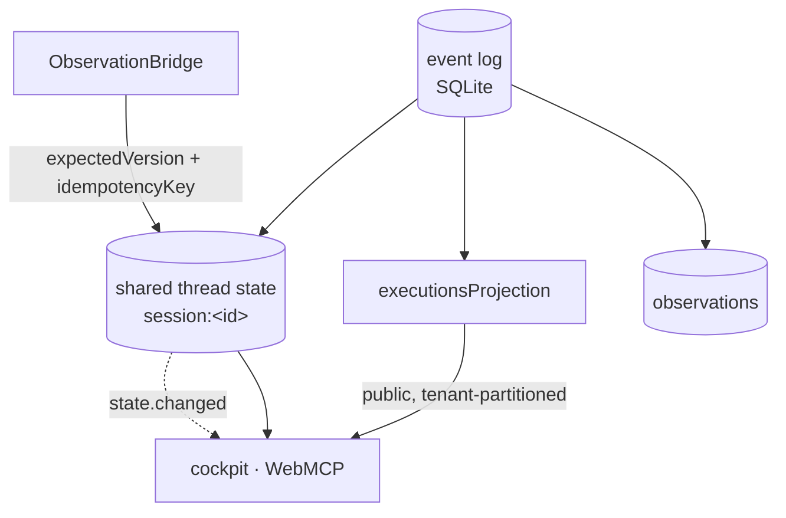

# State, projections and persistence

Covers `src/projections/executions.ts`, the bridge's shared-state writes, and the Cognate SQLite
store.

## Purpose

Make durable truth reconstructible. One event log is authoritative; world state, execution history
and focus context are all reductions of it, and every reduction is versioned or idempotent enough
to survive a restart without tearing or double-recording.

## Responsibilities

- Fold execution and run events into the `executions` read model.
- Bridge runtime-level run events to their execution entry.
- Maintain versioned world shared state with optimistic concurrency.
- Keep the store path configurable and testable (`:memory:`).
- Keep derived state honestly rebuildable.

## Non-responsibilities

- It does not interpret semantics; the projection is a mechanical fold.
- It does not own the event log's retention policy.

## Position in the system

## Core abstractions

### The store

`.cognate/app.sqlite` by default. Overrides: `GSTERM_STORE`, the `store` option on
`StartServerOptions`, or `:memory:` in tests. It is git-ignored. Cognate owns durability; gs-term
chooses the path.

### `executionsProjection`

`name: "executions"`, `version: "1.0.1"` (the bump encodes tenant-partitioned keys so stale
checkpoints rebuild rather than misread).

Entry shape: `{executionId, runId, correlationId, status, worldId?, source?, surface?, command?,
argv?, cwd?, actor?, startedAt?, endedAt?, durationMs?, exitCode?, timedOut?, effects[],
effectsCount, reason?}`.

`status`: `started → settled | failed | cancelled`.

### The run identity bridge

Runtime-level events know a run, not an execution. `execution.started` therefore also writes a
marker key `<tenant>/run:<runId>` containing the execution id. When `run.failed` or
`run.cancelled` arrives, `executionIdForRun` looks the id up and patches the right entry.

Consequence for readers: raw projection reads contain `run:`-prefixed keys that are not executions.
`isMarkerKey(key)` identifies them, and the cockpit uses it.

### Tenant partitioning

Public projection keys are `<tenant>/<key>`. This is required by the runtime's public-projection
read filter — an unpartitioned projection would not be readable through the public path.

### World shared state

Thread `session:<sessionId>`, payload `WorldStateView`. Written by the bridge only.

| Concern | Mechanism |
| --- | --- |
| Lost updates | `expectedVersion` + re-read/retry (5 attempts) |
| Duplicate application | unique idempotency key per attempt |
| Torn reads | readers see whole snapshots, never a mix |
| Honesty | `unknown` scopes with reasons; previously observed values retained rather than flipped false |
| Restart safety | the state is durable, so the cockpit shows it after a restart |

### Observations

Idempotency keys are stable per fact:

- discovered facts: `fact:port:<worldId>:<port>:<observedAt>`,
  `fact:git-dirty:<worldId>:<observedAt>`
- fanned-out effects: `effect:<executionId>:<kind>:<worldId>:<target>:<index>`

Replaying the same fact is a no-op rather than a duplicate.

## Internal operation

The projection is a pure `apply(event, state) → entries`. Nothing in it reaches out; it cannot
observe, invoke, or fail for environmental reasons. A rebuild replays the log.

World state reconciliation is the bridge's job and is described in
[observation-bridge.md](observation-bridge.md); the only persistence-specific part is the optimistic
concurrency loop.

## State

This subsystem *is* state management. Two kinds of state in the log world:

- **authoritative**: events;
- **derived**: projections and shared thread state.

Only the first must be trusted after a version change.

## Lifecycle

Continuous while the server runs. Restart replay rebuilds the projection; shared state is simply
read again.

## Failure modes

| Symptom | Cause | Behaviour |
| --- | --- | --- |
| Repeated `world-state …` errors | version conflicts beyond 5 attempts | reported; the next trigger retries |
| Projection reads show `run:` keys | marker keys are in the same namespace | `isMarkerKey` filters them (debt D-025) |
| Projection rows stale after a version bump | old checkpoint | the runtime rebuilds from the log |
| Store locked / unwritable | permissions or a concurrent process | startup fails; no degraded mode |
| Execution rows with an empty command | a runtime-level event arrived with no `execution.started` | no row is created (`executionIdForRun` finds nothing) |

## Extension points

A new projection: implement `apply`, register it in `createGsTermRuntime`'s `projections` array with
an explicit `public` flag, tenant-partition its keys, and bump its version on any key-shape change.
Consumers must then be taught about any marker keys it introduces.

## Source trail

- `src/projections/executions.ts` — `executionsProjection`, `scopedKey`, `marker`, `isMarkerKey`
- `src/bridge/observation.ts:227-246` — `writeWorldState` optimistic concurrency
- `src/bridge/observation.ts:182-216` — `recordDiscoveredFacts` idempotency keys
- `src/bridge/observations.ts:41` — effect fan-out idempotency key
- `src/server/index.ts:47` — store path resolution
- `src/semantic/contracts.ts:234-251` — `WorldStateView`
- `test/journeys/journey-j5-restart-durability.test.ts` — durability across a full restart