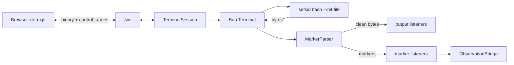

# Terminal session and shell integration

Covers `src/terminal/session.ts`, `src/terminal/scrollback.ts`, `src/terminal/protocol.ts`,
`src/shell/markers.ts`, `src/shell/bash-init.sh`.

## Purpose

Provide a **real** terminal — a real PTY running a real shell — that many viewers can attach to
across disconnects, while also exposing deterministic command-boundary facts to the semantic layer.

## Responsibilities

- Own exactly one `Bun.Terminal` and one child shell process.
- Multiplex viewers (attach/detach) with bounded scrollback replay.
- Propagate resizes to the real tty.
- Parse shell-integration markers out of the byte stream and strip them before viewers see them.
- Report session liveness and exit honestly; never respawn silently.
- Tear down deterministically.

## Non-responsibilities

- It does not know Cognate exists. Markers are handed to listeners; deciding what they mean is the
  bridge's job.
- It does not interpret command output into structured data.
- It does not persist anything.

## Position in the system



## Core abstractions

### `TerminalSession`

| Member | Meaning |
| --- | --- |
| `id` | session id, default `main` |
| `cols`, `rows` | current dimensions |
| `alive` | whether the child is running |
| `exitCode` | child exit code once exited, `null` before |
| `shellPid` | the shell's own pid, taken from the ready marker when available |
| `start()` | create the PTY, spawn the shell, subscribe to exit |
| `write(data)` | viewer input |
| `resize(cols, rows)` | validated: integers, ≥ 1, ≤ 512×256 |
| `attach({output, marker, exit, resize})` | register listeners, replay scrollback, return `detach` |
| `close()` | clear listeners, close the PTY, `SIGTERM` then `SIGKILL` after 2 s |

### `Scrollback`

A byte-bounded ring buffer (`session.scrollback_bytes`, default 256 KiB). Oldest bytes are dropped
first. It exists only in memory; `replay()` is what an attaching viewer receives before live bytes.

### Marker protocol

```
ESC ] 7311 ; <code> ; <base64(JSON)> BEL
```

| Code | Meaning | Payload |
| --- | --- | --- |
| `A` | command start | `{command, cwd, startedAtMs}` |
| `D` | command done | `{exitCode, cwd, endedAtMs}` |
| `R` | integration ready | `{shell, cwd, pid}` |

Base64 exists because command text may contain any byte except BEL/ESC; JSON stays lossless through
the escape.

`MarkerParser` is incremental and handles the awkward cases:

- a marker split across PTY chunks is held and completed;
- a trailing partial *prefix* (e.g. `ESC ] 731`) is held for the next chunk, not flushed as data;
- a malformed payload is stripped as data and never guessed at;
- an unknown code is dropped;
- a pathologically unterminated marker (> 8 KiB) is flushed as ordinary data, bounding memory;
- ordinary output containing BEL or ESC without the prefix passes through untouched.

`src/shell/bash-init.sh` installs a `DEBUG` trap (command start) and `PROMPT_COMMAND` (command
done), and discards environment-inherited prompt hooks so a parent IDE's prompt machinery cannot
masquerade as a user command.

## Internal operation

`start()` creates the terminal, then spawns. The spawn is worth reading closely:

```ts
const setsid = Bun.which("setsid");
const argv = setsid
  ? [setsid, shell, "--init-file", initFile]
  : [shell, "--init-file", initFile];
```

`Bun.spawn({terminal})` on Bun 1.4.0 does **not** make the child a session leader. Without
`setsid` the shell has no job control, `Ctrl-C` never reaches its foreground jobs, and the process
group looks wrong. With `setsid`, bash reports `Ss+`, interrupts work, and the shell survives.

`handleData` splits every chunk into clean bytes and markers. On an `R` marker the ready-marker's
`pid` replaces the spawn pid — robust even if a launcher wrapper forked. Markers go to marker
listeners; clean bytes go to the scrollback ring and to output listeners.

`close()` clears listener sets first, closes the terminal, then terminates the child with a 2 s
grace before `SIGKILL`.

## State

Owns the PTY, the child process handle, the parser's held bytes, the scrollback ring, and the four
listener sets. It holds no durable state and no semantic state.

## Lifecycle

`construct → start() → (attach/detach)* → exit (listeners notified) → close()`.

Exit is terminal: the session is marked not alive, its exit code is recorded, any held marker bytes
are flushed to viewers, and exit listeners fire. There is no respawn. A viewer sees an honest dead
shell.

## Failure modes

| Symptom | Cause | Diagnostic |
| --- | --- | --- |
| "no job control", Ctrl-C ignored | `setsid` not on `PATH` | `bun run doctor` reports PTY `degraded` |
| Command never settles | markers lost because the PTY died abnormally (debt D-018) | no `execution.completed` for the command |
| Compound line records only the first command | bash `DEBUG`-trap semantics (debt D-014) | the execution's `command` field |
| Exit 130 never observed | interrupt path broken (usually the `setsid` case) | `test/conformance/pty.test.ts` |
| Resize ignored | out-of-range dimensions rejected silently | values must be integers in [1,512]×[1,256] |

## Extension points

- **Another shell**: implement a marker producer and keep the codes; the parser and the bridge only
  depend on the three codes. Debt D-012 records that bash is currently the only adapter.
- **More sessions**: the session id is already configuration, and the world-state thread id is
  `session:<id>`. Multi-session is a debt item (D-013), not an architectural blocker.

## Source trail

- `src/terminal/session.ts` — `TerminalSession`, `start`, `handleData`, `attach`, `close`
- `src/terminal/scrollback.ts` — `Scrollback`
- `src/terminal/protocol.ts` — `encodeControl`, `decodeClientControl`
- `src/shell/markers.ts` — `MARKER_PREFIX`, `MarkerParser`, `decodePayload`
- `src/shell/bash-init.sh` — the hook installation
- `test/conformance/pty.test.ts` — resize, interrupt, exit, cleanup contracts
- `test/conformance/shell-markers.test.ts` — parser edge cases
- `test/journeys/journey-j1-human-command-observation.test.ts` — markers never leak to viewers