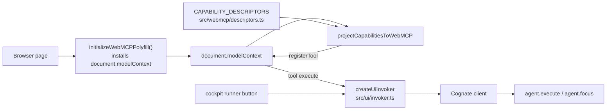

# WebMCP projection

Covers `src/webmcp/descriptors.ts`, `src/webmcp/project.ts`, `src/webmcp/consumption.ts`, and the
boot code in `src/ui/main.tsx`.

## Purpose

Expose gs-term's capabilities to a browser's model context **as a projection of the same
descriptors the cockpit uses** — one implementation per operation, every surface delegating to it.

## Responsibilities

- Define capability descriptors as the authoritative definition of what surfaces may do.
- Register each descriptor as a standard WebMCP tool on `document.modelContext`.
- Route every tool `execute` through the shared invoker.
- Validate tool input before any side effect.
- Preserve the inverse seam (external offers) as types without building it.

## Non-responsibilities

- It does not implement business logic. Business logic lives behind capabilities and agents.
- It does not transport Cognate protocol directly; the cockpit's client does.
- It does not expose human-only operations.

## Position in the system



## Core abstractions

### `ToolDescriptor`

```ts
{ name, description, inputSchema, invoke(invoker, args) }
```

Descriptors are pure metadata plus a thin adapter. The `name` and `description` speak domain
meaning ("Execute a command as a structured semantic execution… Prefer this over typing into the
terminal.") and never leak mechanism vocabulary.

### `ToolInvoker`

The single injected seam every surface uses:

| Method | Lands on |
| --- | --- |
| `executeCommand` | `startRun("agent.execute")`, `source: "webmcp"` |
| `worldState` | `readSharedState(session:<id>)` |
| `focusSearch` | `startRun("agent.focus", intent "search")` → `focus.search` |
| `focusInspect` | `startRun("agent.focus", intent "inspect")` |
| `focusProposeCandidate` | `startRun("agent.focus", intent "propose")` |
| `codeOperation` | `startRun("agent.focus", intent "code")` → `code.*` |

Each takes a `source` of `"ui" | "webmcp"`, which the invoker turns into a `surface` name
(`cockpit` / `webmcp`). That is the only difference between a cockpit button and a browser tool.

### `projectCapabilitiesToWebMCP`

Registers each descriptor as a tool. Registration failures are **collected and reported**, not
swallowed: one bad descriptor does not silently drop the others. The boot logs registered names and
failures.

### The tool set

| Tool | Purpose |
| --- | --- |
| `execute_command` | structured execution; accepts `argv`, `cwd`, `timeoutMs`, `worldId` |
| `get_world_state` | cwd, repository, processes, ports, last execution |
| `focus_search` | Syntelligent Search with optional `referent` |
| `focus_inspect` | read SharedFocus + affordances |
| `focus_propose_candidate` | propose a candidate; SharedFocus unchanged |
| `code_references`, `code_definition`, `code_diagnostics` | precise code semantics, 1-based positions |

Full schemas: [../reference/webmcp-tools.md](../reference/webmcp-tools.md).

**One deliberate omission encodes a rule:** there is no tool to accept, pin or reject a focus
proposal. A machine may inspect and propose; only a human resolves.

### API shape decisions

- WebMCP input is **JSON text**. The installed `@mcp-b/webmcp-polyfill` v5 exposes
  `initializeWebMCPPolyfill` and `executeTool(tool, inputArgsJson: string)`, returning a JSON
  string. The code is typed against the verified dist rather than the package's newer documented API
  (debt D-021).
- `document.modelContext` only. The deprecated `navigator.modelContext` alias is never referenced —
  enforced by `test/architecture.test.ts`.

### The consumption seam (`consumption.ts`)

Types only: an external tool description mapped onto Cognate's `RemoteCapabilityOffer` — lease-bound,
TTL-bounded, never authority-granting. The mapping is tested; the consumption loop is deliberately
not built (debt D-022).

## Internal operation

Boot order in `src/ui/main.tsx`: fetch `/api/meta` → create the Cognate client → install the
polyfill if `document.modelContext` is absent (preserving any native implementation) → build the
invoker → project the descriptors → render the cockpit. A failure in projection logs a warning and
still renders the UI.

## State

None. Descriptors are immutable; the invoker is a thin client wrapper.

## Lifecycle

Once per page load.

## Failure modes

| Symptom | Cause | Behaviour |
| --- | --- | --- |
| `[webmcp] tool projection unavailable` | polyfill or registration failed | warning; the cockpit still renders |
| One tool missing, others present | that descriptor's `registerTool` threw | listed in `result.failed` |
| `get_world_state` stale | world state is reconciled at settlement/attach, not continuously | expected; refresh by attaching or running a command |
| `code_*` fails on a remote world | SolidLSP is local-only | explicit "unavailable" wording in the tool description |

## Extension points

See [../how-to/add-a-webmcp-tool.md](../how-to/add-a-webmcp-tool.md). Adding a tool means adding a
descriptor; no new transport, no second registration path.

## Source trail

- `src/webmcp/descriptors.ts` — `CAPABILITY_DESCRIPTORS`, `ToolInvoker`, `ToolDescriptor`
- `src/webmcp/project.ts` — `WebMCPToolSpec`, `pageModelContext`, `projectCapabilitiesToWebMCP`
- `src/webmcp/consumption.ts` — `ExternalWebMCPTool`, `ExternalOfferRequest`
- `src/ui/invoker.ts` — `createUiInvoker`, `CognateClientLike`
- `src/ui/main.tsx` — polyfill install and projection boot
- `test/webmcp/webmcp-projection.test.ts` — projection, validation, no accept tool, offer mapping
- `test/architecture.test.ts:47-61` — one projection path, current API only