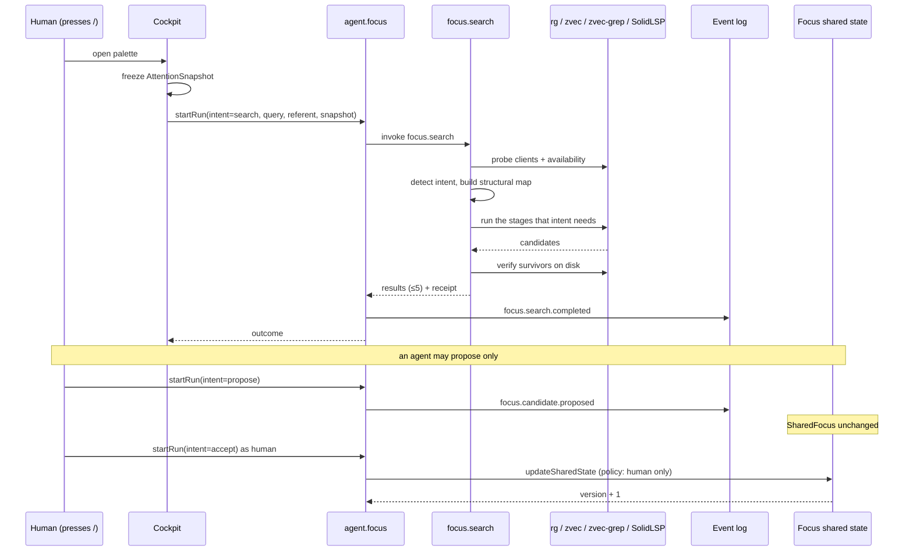

# Workflow: focus search and focus governance (J7–J15)

## Summary

Pressing `/` in the cockpit freezes an attention snapshot and runs Syntelligent Search: a
deterministic reduction that routes by intent, spends the fewest mechanisms that can answer the
question, verifies survivors against the world, and returns at most five results plus a receipt.
Separately, an agent may *propose* a shift of the shared focus; only a human may accept, pin or
reject.

## Sequence: a search

1. The cockpit opens the command palette. An `AttentionSnapshot` is frozen: world, workspace,
   SharedFocus version, referent, pointer entity, active execution, active panel, provenance
   (`method` + the precedence applied).
2. The invoker calls `startRun("agent.focus", {intent: "search", query, worldId, referent?,
   snapshot?, execution?})`.
3. Policy: actor must be recognised; `focus.search` must be granted.
4. `agent.focus` invokes `focus.search` and emits `focus.search.completed` with the receipt id.
5. The component resolves the world's provider and root, ensures the concept index (once per
   runtime), and calls `syntelligentSearch`.
6. `syntelligentSearch` probes substrate clients (`helper.ensureStarted`, `modelStatus`,
   `solidlsp.ensureStarted`, `startWorkspace`). A client that fails to probe is dropped.
7. `resolveAvailability` reports truthful per-mechanism status for **this** world — remote worlds
   report `solidlsp`/`zvec`/`zvec-grep` unavailable.
8. The structural map is built if needed and `focusScope` is narrowed by the referent's directory or
   by concept links.
9. Routing runs for the detected intent, pushing onto `stages`:
   - `why-did-this-fail` → execution evidence first;
   - `who-calls-this` / `what-is-this` → coordinate-first SolidLSP, rg only as a stated fallback;
   - exact identifier → rg, bounded;
   - `architecture` → concepts + structural scope, then **stop**;
   - `semantic` → concepts → structural scope → zvec-grep → rg snippet verification.
10. Candidates are de-duplicated by `entity.id` and capped at five.
11. A `SearchReceipt` is assembled with availability, stages (name + mechanism + true candidate
    count), the reduction funnel, results and `provenance: {method, crossWorld: false}`.
12. The agent emits `focus.search.completed` and returns the outcome; the UI offers affordances for
    each result.

## Sequence: focus governance

| Step | Intent | Effect |
| --- | --- | --- |
| an agent notices something matters | `propose` | emits `focus.candidate.proposed`; **SharedFocus unchanged** |
| a human looks at the shared focus | `inspect` | read-only; returns goal, primary, pinned, working set, unresolved, version, affordances |
| a human accepts | `accept` | `acceptCandidate` → `updateSharedState` → version increments; emits `focus.candidate.resolved` |
| a human pins | `pin` | `pinEntity` adds to `pinned` without replacing `primary`; emits `focus.pinned` |
| a human rejects | `reject` | marks the candidate rejected; SharedFocus unchanged; the same `evidenceToken` cannot be reproposed |

`accept`/`pin`/`reject` call `ctx.updateSharedState`, which the action policy permits **only** for
`human` on a `focus:` thread. `src/focus/focus.ts` additionally throws `FocusAuthorityError` for a
non-human actor — defence in depth that makes the invariant directly testable.

## Symbol resolution tiers (the receipt's provenance)

| Tier | Trigger | Mechanism used |
| --- | --- | --- |
| `exact-coordinate` | referent has `path:line:column` | SolidLSP directly; no discovery at all |
| `document-refined` | `path:line` known | one line read via the world port → identifier column; else file-local document symbols |
| `workspace-symbol` | name only | `workspaceSymbols` with bounded retries (cold tsserver tolerated) |
| `declaration-fallback` | still nothing | rg purely as a **position finder**, then warm the document |

An exact coordinate never triggers a workspace search. This is a deliberate reduction property and
is asserted by tests.

## Detailed path

| Concern | Symbols |
| --- | --- |
| agent dispatch | `src/agents/focus.ts:36` `focusAgent` |
| capability | `src/components/focus.ts` `focusComponent` |
| planner | `src/focus/search.ts:260` `syntelligentSearch`, `:185` `resolveSymbolTarget`, `:64` `detectIntent` |
| availability | `src/focus/mechanisms.ts` `resolveAvailability` |
| structural map | `src/focus/mechanisms.ts` `buildStructuralMap` |
| concepts | `src/focus/concept-index.ts` `ensureConceptIndex`, `conceptQueryFor` |
| governance | `src/focus/focus.ts` `acceptCandidate`, `pinEntity`, `rejectCandidate` |
| attention | `src/focus/attention.ts` `ATTENTION_PRECEDENCE` |
| affordances | `src/focus/affordances.ts` `affordancesFor` |

## State changes

| When | Change |
| --- | --- |
| propose | an event; SharedFocus version unchanged |
| accept / pin | SharedFocus version increments; `updatedAt` advances |
| reject | the candidate's status changes; SharedFocus unchanged |
| search | no focus state written; the receipt records the SharedFocus version it saw |
| concepts rebuild | the store is replaced and the digest marker updated (once per digest change) |

## Failure branches

| Branch | Behaviour |
| --- | --- |
| `SolidLSP not mounted` | `code.*` throws; search degrades to rg and states that semantic verification was unavailable |
| Cold tsserver returns empty `workspaceSymbols` | bounded retries (3 × 1.2 s), then the rg position fallback |
| Cold references answer empty | warm-up then bounded retries; never a coordinate rediscovery |
| Concept store absent | no concept stage; `availability` reports it |
| Agent tries to accept | `FocusAuthorityError` + action-policy denial; SharedFocus unchanged |
| Same candidate reproposed with the same evidence token | blocked |
| Remote world query | mechanisms reported unavailable; local results are never substituted |
| A zvec-grep snippet does not exist on disk | the candidate is dropped; `verified` reflects what survived |

## Sequence diagram

## Source trail

- `src/agents/focus.ts`, `src/components/focus.ts`
- `src/focus/search.ts`, `src/focus/mechanisms.ts`, `src/focus/concept-index.ts`
- `src/focus/focus.ts`, `src/focus/attention.ts`, `src/focus/affordances.ts`
- `src/semantic/focus.ts` — the shapes
- `test/focus/search.test.ts`, `search-semantic.test.ts`, `attention.test.ts`,
  `focus-lifecycle.test.ts`, `integration.test.ts`
- `test/journeys/journey-j9-semantic-reduction.test.ts` — routing and latency measurements
- `.sea/interaction/canonical-journey-catalog.md` — J7–J15 definitions