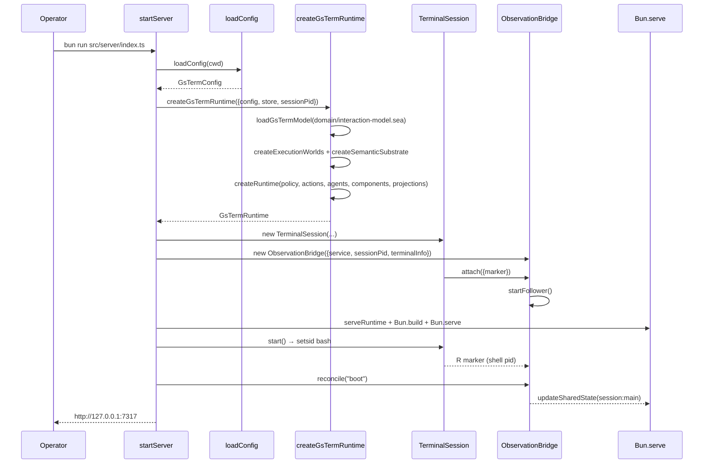

# Startup and shutdown

## Summary

One Bun process brings up the semantic model, the Cognate runtime, one real PTY, the observation
bridge, and then the HTTP/WebSocket/Connect transports — in that order, because each layer needs the
previous one. Shutdown reverses it so nothing is left holding a dead dependency.

## Sequence

**Startup**

1. `startServer({config?, domainRoot?, store?})` — config is loaded if not supplied.
2. Store path resolved: `options.store` → `GSTERM_STORE` → `<domainRoot>/.cognate/app.sqlite`.
3. `createGsTermRuntime`:
   1. `workspaceRoot(config)`;
   2. `domain/interaction-model.sea` read and parsed; required semantic ids checked;
   3. capability contracts bound explicitly;
   4. `createExecutionWorlds` — registry with the local provider plus configured SSH worlds;
   5. `createSemanticSubstrate` — clients constructed, nothing started;
   6. concept-index freshness promise created lazily (not awaited);
   7. `createRuntime` with policy, actions, the three agents, four components, and the public
      `executions` projection.
4. `TerminalSession` constructed with the shell, init file, cwd, dimensions and scrollback bound.
5. `ObservationBridge` constructed against `runtime.service` with closures that read live session
   state; its marker listener attached to the session; `startFollower()` begins.
6. Internal Connect server bound to `127.0.0.1:0`.
7. `Bun.build` the cockpit bundle for the browser; a build failure aborts startup.
8. `Bun.serve` on `config.server.hostname:port` with the route table and WebSocket handlers.
9. `session.start()` — PTY created, `setsid bash --init-file …` spawned.
10. `bridge.reconcile("boot")` — the initial world view is derived from observed facts.

**Shutdown** (`stop()`, also wired to `SIGINT`/`SIGTERM`)

1. `bridge.close()` — set `closed`, abort the event follower, drain the serialised chain.
2. `session.close()` — clear listeners, close the PTY, `SIGTERM` then `SIGKILL` after 2 s.
3. `server.stop(true)` — drop open connections.
4. `internal.stop()` — the Connect server.
5. `app.close()` — runtime, world registry (`dispose`), substrate (`dispose` of both clients with
   `allSettled`).
6. `process.exit(0)`.

## Detailed path

| Step | Symbols |
| --- | --- |
| entry | `src/server/index.ts:209` `import.meta.main` branch |
| config | `src/config.ts:114` `loadConfig` |
| model | `src/app/bindings.ts:28` `loadGsTermModel` |
| worlds | `src/app/worlds.ts:35` `createExecutionWorlds` |
| substrate | `src/mechanisms/substrate.ts` `createSemanticSubstrate` |
| runtime | `src/app/runtime.ts:47` `createGsTermRuntime` |
| session | `src/terminal/session.ts:52` `start` |
| bridge | `src/bridge/observation.ts:81` `reconcile`, `:86` `startFollower` |
| transport | `src/server/index.ts:80` `serveRuntime`, `:82` `Bun.build`, `:95` `Bun.serve` |

The session pid provider is passed as a closure (`() => session?.shellPid`) because the session
does not exist yet when the runtime is constructed.

## State changes

- A SQLite store is created or opened.
- The `executions` projection checkpoint is initialised or rebuilt as needed.
- A real shell process is created under a PTY.
- Shared thread state `session:<id>` is written once with the boot world view.
- Ports may be taken: the configured one, and the ephemeral loopback port for the internal Connect
  server.

## Failure branches

| Failure | Result |
| --- | --- |
| `gsterm.toml` invalid | `loadConfig` throws; no server |
| model missing a required semantic object | startup aborts with the model path |
| unknown world kind / missing host key pinning | startup aborts in `parseSshWorld` |
| UI bundle fails | startup aborts with the bundler log |
| PTY spawn fails | `Bun.spawn` throws inside `session.start()`, after the transports are up; the process exits non-zero |
| `reconcile("boot")` errors | reported through `onError`; the server still runs with an unwritten world view |

## Sequence diagram

## Source trail

- `src/server/index.ts` — `startServer`, `GsTermServerHandle.stop`, signal handlers
- `src/app/runtime.ts` — `createGsTermRuntime`, `GsTermRuntime.close`
- `src/terminal/session.ts` — `start`, `close`
- `src/bridge/observation.ts` — `startFollower`, `close`, `reconcile`
- `src/mechanisms/substrate.ts` — `dispose`
- `e2e/serve.ts` — the test/e2e server wrapper