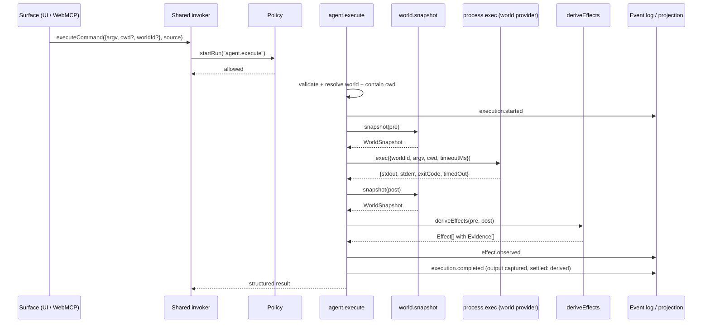

# Workflow: structured execution (J2)

## Summary

A machine — a cockpit button, a WebMCP tool, or a future agent — asks to run a command with `argv`.
The `agent.execute` run snapshots the world, invokes `process.exec` on the selected world's provider,
snapshots again, derives effects with evidence, and settles with captured output. The result lands
in the same projection, the same event vocabulary and the same world state as a human-typed command.

## Sequence

1. A surface calls the shared invoker with `{argv, cwd?, worldId?, timeoutMs?}` and a `source` of
   `ui` or `webmcp`.
2. The invoker calls `client.startRun("agent.execute", input, {idempotencyKey, correlationId})`.
3. The kernel policy checks the actor (`human`, `webmcp`, `system`) and the capability
   (`process.exec`). The action policy checks that the agent is a catalogued journey.
4. `agent.execute` validates input: `argv` non-empty, no NUL, `source ∈ {ui, webmcp, pty}`.
5. `worldId` is resolved (default world id when empty); a world with no root **fails closed**.
6. `cwd` is contained: `resolveLocal(worldRoot, cwd)`. An escape aborts before invocation.
7. `executionId` and `startedAt` are produced through `ctx.step` (recorded, replayable).
8. `execution.started` is emitted with `source`, `surface`, `worldId`, `command`, `argv`, `cwd`,
   `startedAt`, `actor`.
9. `world.snapshot` (pre) is invoked and shape-checked.
10. `process.exec` is invoked with `{worldId, argv, cwd, timeoutMs}`; the world's provider decides
    whether that is a local spawn or a remote command.
11. `world.snapshot` (post) is invoked.
12. `deriveEffects(pre, post)` runs; `effect.observed` is emitted.
13. `execution.completed` is emitted with `exitCode`, `timedOut`, `endedAt`, `durationMs`, truncated
    `output`, `effectsCount`, `settled: "derived"`.
14. The agent returns its structured result (including the full effect list) to the caller.
15. The run completes. If its correlation is the session thread, the bridge reconciles world state.

## Detailed path

| Step | Symbols |
| --- | --- |
| surface call | `src/ui/invoker.ts` `createUiInvoker` → `executeCommand` |
| run start | `startRun("agent.execute", …)` |
| policy | `src/app/policy.ts:27` `gstermPolicy`, `:46` `gstermActions` |
| validation | `src/agents/execute.ts:19` `parseInput` |
| world + containment | `src/agents/execute.ts:48-52` |
| execution | `src/agents/execute.ts:72` `ctx.invoke("process.exec")` |
| effects | `src/semantic/effects.ts:82` `deriveEffects` |
| settlement | `src/agents/execute.ts:88` `execution.completed` |
| read model | `src/projections/executions.ts:64` `executionsProjection` |
| reconcile | `src/bridge/observation.ts:93` `followRuns` |

## State changes

| When | Change |
| --- | --- |
| `execution.started` | projection row with `status: started`, `source`, `surface`, `worldId`, `argv`, `cwd`, `actor` |
| `effect.observed` | row gains `effects[]` and `effectsCount` |
| `execution.completed` | row becomes `status: settled` with exit code, timing |
| fan-out | focus-relevant effects become run-less observations correlated to the run |
| reconcile (session correlation) | shared state `session:<id>` updates repository/processes/ports and `lastExecution` |

## Failure branches

| Branch | Behaviour |
| --- | --- |
| Unknown world | `unknown execution world: <id>`; the run fails before any event |
| `cwd` outside the world root | containment failure; the run fails before invocation (debt D-003) |
| Policy denial | the run never starts |
| Timeout | `timedOut: true` in the completion payload; the local provider kills the process (not its process group — debt D-031) |
| `world.snapshot` malformed | `execution.failed`; the run fails |
| Exception mid-run | `execution.failed` with the reason, then rethrow so run status is `failed` |
| Empty/garbage `argv` | rejected during validation |

## Sequence diagram

## Multi-world behaviour

The **same** `process.exec` capability, argv and semantic model apply in every world. `worldId` is
an input property. Switching worlds changes where it ran and which files the effects name — it does
not change what kind of thing happened.

Remote worlds still produce real evidence: snapshots are taken through the world's SFTP file port
and its remote process port, so `file.created` can carry remote provenance. Exit code 0 is never
treated as proof.

## Source trail

- `src/agents/execute.ts` — the whole agent
- `src/app/policy.ts` — grants and journey allow-list
- `src/app/worlds.ts` — provider selection by `worldId`
- `src/semantic/effects.ts` — effect derivation
- `src/ui/invoker.ts` — the shared invoker both surfaces use
- `src/webmcp/descriptors.ts` — `execute_command`
- `test/journeys/journey-j2-structured-execution.test.ts` — boot settles a structured execution
- `test/journeys/journey-j2-worlds.test.ts` — same command, two worlds
- `test/app.test.ts` — denied actor, containment
- `e2e/acceptance.spec.ts` — acceptance C/E